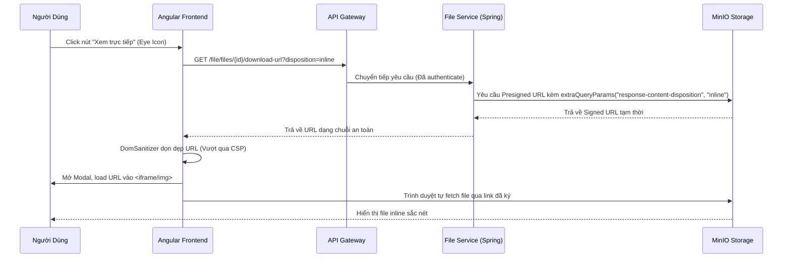

# Cà Phê Kỹ Thuật: Giải Mã Tính Năng Xem PDF & Ảnh Hóa Đơn Trực Tiếp (FE & BE)

> **Chào bạn!** Nếu bạn đang đọc file này, có thể bạn đang muốn hiểu sâu hơn về cách chúng tôi đã giải quyết bài toán hiển thị file PDF và ảnh biên lai ngay trong popup ứng dụng, thay vì ép người dùng tải về hay mở tab mới. Hãy cùng nhâm nhi một ly cà phê và mổ xẻ giải pháp này nhé! ☕

---

## 1. Approach & Reasoning (Cách tiếp cận & Logic suy nghĩ)

Khi bắt đầu bài toán "Xem trực tiếp tệp hóa đơn chi tiêu", điểm xuất phát của chúng tôi là: **Làm sao để an toàn, mượt mà và tốn ít tài nguyên nhất?**

Hóa đơn của người dùng được lưu trữ bảo mật trong **MinIO Object Storage** của Backend (`file-service`). Để Frontend (`frontend`) có thể đọc được tệp, chúng tôi sử dụng **Presigned URL** (URL được ký số tạm thời có thời hạn 15 phút). 
*   **Tại sao lại là Presigned URL?** Vì thẻ `<iframe>` hay `` trên trình duyệt mặc định không thể tự chèn thêm header chứa JWT Token (`Authorization: Bearer <token>`). Presigned URL giải quyết triệt để chuyện này bằng cách nhúng thẳng token chữ ký số mã hóa của MinIO vào chuỗi query parameters. Bất kỳ ai có link đều có thể đọc trực tiếp tệp tin đó trong vòng 15 phút mà không cần đăng nhập lại.
*   **Vấn đề phát sinh:** Mặc định, khi click vào link này, trình duyệt sẽ tự động tải file xuống (forced download) vì server trả về header ép tải.
*   **Giải pháp:** Chúng tôi nâng cấp Backend để sinh ra URL có đính kèm chỉ thị phản hồi `response-content-disposition=inline`. Khi trình duyệt nhận được chỉ thị này, nó hiểu rằng: *"À, tệp này hãy hiển thị trực tiếp lên màn hình đi, đừng tải về máy nữa!"*.

---

## 2. Roads Not Taken (Những con đường không đi)

Hiểu được tại sao chúng tôi từ bỏ các phương án khác sẽ giúp bạn tránh được những vết xe đổ tương tự:

*   **Phương án loại bỏ 1: Stream file qua Endpoint Backend (e.g. `/api/files/{id}/content`)**
    *   *Tại sao bỏ?* Như đã nói ở trên, iframe không thể gửi custom header `Authorization`. Nếu đi theo cách này, chúng tôi sẽ phải truyền JWT token thẳng lên URL của API Gateway (ví dụ: `?token=eyJ...`), đây là một **lỗ hổng bảo mật nghiêm trọng** vì token sẽ bị ghi lại trong nhật ký hệ thống (system logs) của Gateway và Nginx. Ngoài ra, việc Backend phải tải file từ MinIO về rồi tự stream lại cho Frontend sẽ làm RAM và CPU của server Backend bị nghẽn khi có nhiều người xem file cùng lúc.
*   **Phương án loại bỏ 2: Mở tệp ở tab mới (`window.open(url, '_blank')`)**
    *   *Tại sao bỏ?* Quá thô sơ! Nó phá vỡ hoàn toàn trải nghiệm Fintech "Premium". Người dùng sẽ liên tục bị chuyển hướng ra ngoài ứng dụng rồi lại phải tắt tab để quay lại. Việc giữ chân người dùng trong một Modal Viewer nội bộ sang xịn mịn là lựa chọn đẳng cấp hơn rất nhiều.
*   **Phương án loại bỏ 3: Dùng thư viện JS bên thứ ba để render PDF (như `ng2-pdf-viewer` hay `pdf.js`)**
    *   *Tại sao bỏ?* Đây là lỗi mà các lập trình viên Beginner rất hay mắc phải. Việc cài thêm thư viện sẽ làm phình to kích thước bundle size của Angular lên tới vài Megabytes, dễ gây xung đột phiên bản và làm chậm tốc độ tải trang. Trong khi đó, 100% trình duyệt hiện đại (Chrome, Safari, Edge, Firefox) đều đã tích hợp sẵn một trình đọc PDF tăng tốc bằng GPU cực kỳ xịn sò. Chỉ cần dùng `<iframe>` và đưa link chuẩn là xong!

---

## 3. How Things Connect (Các mảnh ghép khớp với nhau như thế nào?)

Quy trình hoạt động diễn ra theo một chuỗi mắt xích khép kín:

---

## 4. Tools & Methods (Công cụ & Phương pháp)

*   **MinIO SDK `.extraQueryParams(...)`:** Đây là chiếc đũa thần giúp chúng tôi ghi đè header phản hồi của S3 một cách động khi sinh URL, thay vì sửa chết metadata của file lúc upload.
*   **Angular `DomSanitizer`:** Angular có cơ chế bảo vệ chống XSS (Cross-Site Scripting) cực mạnh. Nó mặc định chặn mọi URL ngoại lai nhúng vào `[src]` của iframe. Chúng tôi bắt buộc phải tiêm `DomSanitizer` và gọi `bypassSecurityTrustResourceUrl(url)` để khai báo với Angular: *"Yên tâm đi, link này đã được Backend của chúng ta ký số an toàn rồi!"*.

---

## 5. Tradeoffs (Sự đánh đổi)

Mọi quyết định thiết kế tốt đều là sự cân bằng giữa các mặt lợi hại:

*   **Thời gian hết hạn của Link (15 phút) vs Trải nghiệm:** Nếu người dùng mở modal xem hóa đơn rồi... đi ngủ, 2 tiếng sau quay lại bấm nút In hoặc Tải trực tiếp trên iframe sẽ bị báo lỗi Link hết hạn. Tuy nhiên, chúng tôi chấp nhận đánh đổi điều này để bảo vệ dữ liệu tối đa. Link hóa đơn không thể bị copy và chia sẻ vô thời hạn ra ngoài internet. Nếu muốn xem lại, người dùng chỉ cần tắt modal đi và bấm mở lại để sinh link mới.

---

## 6. Mistakes & Dead Ends (Sai lầm & Ngõ cụt từng gặp)

Ban đầu, chúng tôi định cấu hình header `Content-Disposition: inline` trực tiếp vào metadata của tệp lúc **Upload**. 

*   **Ngõ cụt xuất hiện:** Nếu làm như vậy, tệp tin đó sẽ luôn luôn hiển thị inline. Khi người dùng click vào nút "Tải xuống" (`downloadReceipt()`), trình duyệt vẫn sẽ... mở trực tiếp file thay vì tải về!
*   **Bài học:** Cách phân phối tệp (Tải về hay Xem trực tuyến) phải được quyết định linh hoạt ở **thời điểm yêu cầu (Retrieval Phase)** thông qua API sinh URL, chứ không được cố định ở **thời điểm tải lên (Upload Phase)**.

---

## 7. Future Pitfalls (Cạm bẫy cần tránh trong tương lai)

*   **Mixed Content trong môi trường Production:** Khi triển khai lên server thật chạy HTTPS, nếu MinIO của bạn cấu hình chạy HTTP thường, trình duyệt sẽ block không cho load iframe vì vi phạm chính sách bảo mật Mixed Content (Trang bảo mật HTTPS nhúng iframe HTTP không bảo mật). Hãy luôn đảm bảo MinIO và Backend chạy đồng bộ giao thức SSL.
*   **Kích thước tệp lớn:** Khi hiển thị hình ảnh biên lai dung lượng lớn (5-10MB), trình duyệt có thể bị giật lag khi mở modal. Hãy cân nhắc nén ảnh hoặc tạo thumbnail ở Backend nếu dự án mở rộng quy mô.

---

## 8. Expert vs Beginner (Tư duy Chuyên gia và Lính mới)

*   **Beginner:** Sợ hãi các lỗi bảo mật của iframe, cố gắng tìm các thư viện JS nặng nề để tự vẽ PDF lên thẻ `<canvas>`. Kết quả là tốn hàng tuần code, app chạy ì ạch và bị vỡ giao diện trên Mobile.
*   **Expert:** Hiểu rõ sức mạnh của trình duyệt. Tận dụng tối đa công cụ có sẵn (`iframe` + native browser PDF reader) bằng cách tối ưu hóa các HTTP header trả về từ Backend. Kết quả là chỉ tốn vài chục dòng code, bundle size siêu nhẹ và tốc độ hiển thị nhanh như chớp.

---

## 9. Transferable Lessons (Bài học áp dụng cho các dự án khác)

*   **Tách biệt lưu trữ và phân phối (Separation of Concerns):** Hãy thiết kế hệ thống lưu trữ file của bạn thật tối giản (chỉ lưu tệp và loại nội dung Content-Type). Hãy để các API Gateway hoặc Controller quyết định cách phân phối tệp đó đến khách hàng bằng cách tùy biến các HTTP headers phản hồi dynamically. Bài học này có thể áp dụng cho mọi dự án quản lý tài liệu, hình ảnh đại diện, video streaming trong tương lai!

---

> Hy vọng tài liệu này sẽ truyền lửa và mang lại nhiều kiến thức bổ ích cho bạn trên con đường chinh phục mã nguồn dự án BabySystem! Chúc bạn code vui vẻ! 🚀
