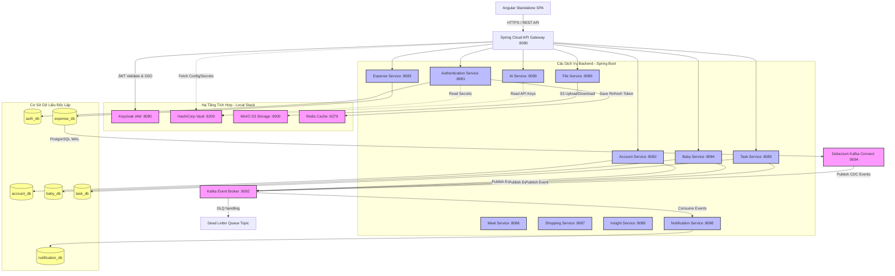

# BabySystem (Mom Super App) – Enterprise Microservices Full-Series Architecture

[]()
[]()
[]()
[]()
[]()
[]()

Chào mừng bạn đến với **BabySystem** (Mom Super App) - một dự án mô phỏng hệ thống quản lý gia đình và chăm sóc em bé cấp doanh nghiệp (Enterprise-grade) được xây dựng theo kiến trúc **Microservices phân tán hoàn chỉnh**. 

Dự án này được thiết kế và triển khai với các tiêu chuẩn công nghệ cao cấp nhất, tương đương với các series dự án microservices lớn (Microservices Full-Series) hiện nay trên thế giới, bao gồm việc giải quyết các bài toán về bảo mật, giao dịch phân tán, tính toàn vẹn dữ liệu và đồng bộ hóa bất đồng bộ.

---

## 🚀 Bản Đồ Kiến Trúc Hệ Thống (System Architecture)



---

## 🛠️ Các Architectural Design Patterns Nổi Bật

Hệ thống được phát triển nhằm mục đích giải quyết thực tế các vấn đề phức tạp trong môi trường phân tán:

### 1. Transactional Outbox & Debezium CDC
Để loại bỏ nguy cơ mất tính nhất quán dữ liệu do cơ chế ghi đồng thời (Dual-Write) vào DB nghiệp vụ và gửi message lên Kafka, BabySystem sử dụng **Transactional Outbox Pattern**.
*   **Outbox Events:** Mọi sự kiện của `expense-service` được ghi trực tiếp vào bảng `outbox_events` trong cùng một transaction nghiệp vụ.
*   **Debezium CDC (Change Data Capture):** Quét các sự thay đổi ở nhật ký ghi trước (Write-Ahead Log - WAL) của PostgreSQL, tự động chuyển đổi dòng dữ liệu mới từ bảng outbox thành Kafka event mà không gây chậm/nghẽn hệ thống.

### 2. Choreography-based Saga Pattern (Duyệt Chi Tiêu)
Quản lý giao dịch phân tán giữa `expense-service` và `notification-service` không dùng cơ chế lock.
*   Khi đề xuất được duyệt, Saga State chuyển sang `STARTED`, đồng thời kích hoạt việc ghi nhận sự kiện thông qua outbox.
*   Nếu có bất kỳ lỗi logic nào xảy ra, hệ thống tự kích hoạt **Compensating Transaction (Giao dịch Bù trừ)** để khôi phục trạng thái tài chính ban đầu một cách an toàn.

### 3. Keycloak IAM Single Sign-On (SSO)
Hệ thống sử dụng **Keycloak** (OIDC / OAuth2) làm giải pháp quản lý danh tính tập trung:
*   Cấp phát Access Token (JWT) ngắn hạn và Refresh Token lưu trữ ở Redis.
*   Kiểm soát phân quyền RBAC (Role-Based Access Control) chặt chẽ, định nghĩa các roles trực tiếp từ Keycloak Realm và map claims để bảo vệ các endpoints API Gateway.

### 4. HashiCorp Vault Secrets Management
Bảo mật tuyệt đối toàn bộ thông tin nhạy cảm của hệ thống (mật mã DB, khóa bí mật JWT, API key của OpenAI/Gemini...).
*   Thông tin được lưu trữ tập trung tại **HashiCorp Vault**.
*   Các dịch vụ sử dụng cơ chế bootstrap an toàn để nạp mật mã trực tiếp vào RAM lúc khởi động, đảm bảo không lưu cứng thông tin nhạy cảm trong codebase.

### 5. Idempotent Consumer & Kafka DLQ (Dead Letter Queue)
*   **Idempotency:** Ngăn chặn việc xử lý trùng lặp các thông báo khi nhận tin nhắn lặp từ Kafka bằng cách theo dõi bảng `processed_events`.
*   **Dead Letter Queue (DLQ):** Toàn bộ tin nhắn lỗi/hỏng cấu trúc sau khi tự động Retry 3 lần không thành công sẽ được cách ly vào topic `.dlq` tương ứng để phân tích và khôi phục, đảm bảo tính chống chịu lỗi cao (Fault Tolerance).

---

## 📦 Bản Đồ Cấu Trúc Các Dịch Vụ (Microservices)

| Dịch vụ | Chức năng chính | Port |
| :--- | :--- | :--- |
| **api-gateway** | Spring Cloud API Gateway, JWT Validation, Rate Limiting | `8080` |
| **authentication-service** | Cấp phát Token, Quản lý đăng nhập, Tích hợp Keycloak, Cấu hình 2FA OTP | `8081` |
| **account-service** | Quản lý người dùng, Hồ sơ cá nhân, Thiết lập mối quan hệ Gia đình | `8082` |
| **expense-service** | Quản lý Tài chính, Ghi chép thu chi, Xử lý Saga duyệt đề xuất | `8083` |
| **baby-service** | Quản lý thông tin chi tiết Em bé, nhật ký phát triển | `8084` |
| **task-service** | Quản lý công việc gia đình, nhắc nhở hạn chót | `8085` |
| **meal-service** | Lên kế hoạch dinh dưỡng, theo dõi bữa ăn hàng ngày | `8086` |
| **shopping-service** | Danh sách mua sắm gia đình dùng chung | `8087` |
| **insight-service** | Tổng hợp dữ liệu, báo cáo thống kê tài chính/sức khỏe | `8088` |
| **file-service** | Upload/Download tệp tin, hóa đơn qua MinIO S3, PDF/Image Viewer bảo mật | `8089` |
| **ai-service** | Đưa ra gợi ý thông minh dựa trên mô hình ngôn ngữ lớn OpenAI/Gemini | `8090` |
| **notification-service** | Consume Kafka events để tạo thông báo Real-time cho gia đình | `8098` |
| **common-lib** | Thư viện đóng gói DTO, API Response chuẩn, custom Exceptions dùng chung | *Library* |

---

## 🎨 Trải Nghiệm Người Dùng Cao Cấp (Angular Frontend)

Ứng dụng Angular Standalone SPA được thiết kế tinh xảo theo triết lý **Premium UI/UX**:
*   **Aesthetics:** Phong cách **Premium Glassmorphism & Bento Layout** siêu hiện đại, tạo cảm giác sang trọng nhờ hiệu ứng đổ bóng mịn màng và độ mờ kính sâu (`backdrop-filter`).
*   **Interactive (Alive UI):** Chuyển động vi mô mượt mà (`cubic-bezier`), hover nhô cao, các hiệu ứng sinh động tăng tương tác trực quan.
*   **RxJS Reactive:** Luồng dữ liệu động thời gian thực hoàn hảo sử dụng RxJS Streams.
*   **ngx-translate i18n:** Đa ngôn ngữ (Tiếng Việt & Tiếng Anh) mượt mà tức thì mà không cần tải lại trang.

---

## ⚡ Hướng Dẫn Khởi Chạy Nhanh (Quick Start)

### 1. Khởi chạy Hạ tầng
```bash
cd codebase/infrastructure
docker compose up -d
```

### 2. Thiết lập Bảo mật & Cấu hình
*   **Nạp Secrets:**
    *   Với Windows (PowerShell): `.\vault\bootstrap-secrets.ps1`
    *   Với Linux/macOS: `sh vault/bootstrap-secrets.sh`
*   **Keycloak Admin:** `http://localhost:8080/admin` (`admin` / `admin`).
*   **Tài khoản Demo Test:** `demo.user` / `demo123`

### 3. Khởi động Backend Services
Build thư viện chung:
```bash
cd codebase/backend/common-lib
mvn clean install
```
Khởi chạy dịch vụ nghiệp vụ (ví dụ: `expense-service`):
```bash
cd ../expense-service
./mvnw spring-boot:run
```

### 4. Khởi động Frontend
```bash
cd codebase/frontend
npm install
npm start
```
Truy cập tại: `http://localhost:4200`

---

## 📑 Tài Liệu Tham Khảo Thêm

Hệ thống cung cấp một thư mục tài liệu nghiệp vụ cực kỳ đồ sộ tại [documents/](file:///d:/AI-AGENT/BabySystem/documents/), bao gồm:
*   [Kiến trúc Enterprise Microservices Chi Tiết](file:///d:/AI-AGENT/BabySystem/documents/babysystem-microservices-series.md)
*   [Hướng dẫn Vận hành Kafka Outbox Saga Debezium](file:///d:/AI-AGENT/BabySystem/documents/expense-outbox-saga-debezium.md)
*   [Tổng quan Nghiệp vụ BabySystem](file:///d:/AI-AGENT/BabySystem/documents/babysystem-overview.md)
*   [Hướng Dẫn Chạy & Debug Hệ Thống](file:///d:/AI-AGENT/BabySystem/documents/babysystem-run-operation-guide.md)
