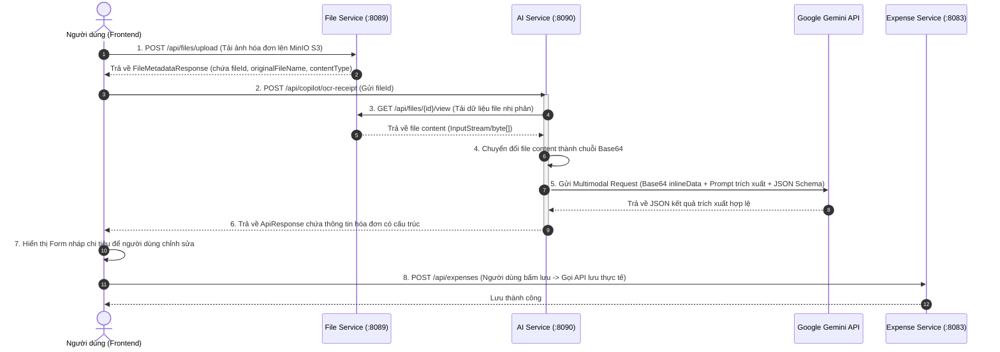

# AI OCR Receipt Scanner - Tài liệu thiết kế hệ thống

> **Service chính:** `ai-service`  
> **Cập nhật lần cuối:** 2026-06-01  
> **Trạng thái:** Chờ phê duyệt thiết kế  

---

## 1. Tổng quan tính năng

Tính năng **AI OCR Receipt Scanner** cho phép người dùng (Mom/Dad) tải lên các hóa đơn chi tiêu gia đình (dạng hình ảnh JPG, PNG, WEBP hoặc file tài liệu PDF) từ các cửa hàng, siêu thị (Con Cưng, Kids Plaza, WinMart, v.v.). Hệ thống sẽ tự động sử dụng **Google Gemini Multimodal API** để trích xuất các thông tin tài chính quan trọng, chuyển đổi thành dữ liệu có cấu trúc JSON để tự động điền vào Form nhập chi tiêu, giúp người dùng tiết kiệm thời gian nhập liệu thủ công và nâng cao chất lượng trải nghiệm của ứng dụng.

### Người dùng mục tiêu
- Các gia đình bận rộn muốn theo dõi chi tiêu nhanh chóng mà không cần gõ tay từng hóa đơn phức tạp.

---

## 2. Luồng dữ liệu và Tương tác (Data Flow)



---

## 3. Đặc tả API Thiết kế

### API: Trích xuất thông tin hóa đơn bằng AI
- **Endpoint:** `POST /api/copilot/ocr-receipt`
- **Headers:** 
  - `Authorization: Bearer <JWT_TOKEN>`
  - `X-User-Id: <user_id>`
  - `X-Family-Ids: <family_ids>`
- **Request Body (JSON):**
```json
{
  "fileId": 123,
  "language": "vi"
}
```

- **Response Body (JSON):**
```json
{
  "success": true,
  "message": "Trích xuất hóa đơn thành công",
  "data": {
    "amount": 250000,
    "date": "2026-06-01",
    "category": "Baby Care",
    "note": "Hóa đơn mua sữa Abbott Grow tại Con Cưng",
    "items": [
      {
        "name": "Sữa Abbott Grow 4 900g",
        "quantity": 1,
        "price": 250000
      }
    ],
    "confidenceScore": 0.95
  }
}
```

---

## 4. Giải pháp kỹ thuật tích hợp

### A. Giao tiếp giữa các Microservices (Internal Communication)
Tại `ai-service`, để tải file từ `file-service`, ta sử dụng `WebClient` hoặc `RestClient` để gọi API `/api/files/{id}/view`. Do cuộc gọi diễn ra trong mạng nội bộ hoặc qua Gateway, `ai-service` sẽ chuyển tiếp JWT token của người dùng hoặc sử dụng Service-to-Service authentication để đảm bảo an toàn thông tin theo chính sách cô lập dữ liệu gia đình (Family Data Isolation).

### B. Gemini Multimodal Payload
Để gửi ảnh lên Gemini v1 API qua REST, ta sử dụng cấu trúc `inlineData` trong phần `parts`.
```json
{
  "contents": [
    {
      "role": "user",
      "parts": [
        {
          "text": "[System Instructions]\nBạn là trợ lý AI chuyên nghiệp của ứng dụng BabySystem. Hãy phân tích hóa đơn mua sắm này và trích xuất thông tin dưới dạng JSON theo đúng schema yêu cầu."
        },
        {
          "inlineData": {
            "mimeType": "image/jpeg",
            "data": "/9j/4AAQSkZJR..." 
          }
        }
      ]
    }
  ],
  "generationConfig": {
    "responseMimeType": "application/json",
    "responseSchema": {
      "type": "OBJECT",
      "properties": {
        "amount": { "type": "INTEGER", "description": "Tổng số tiền thanh toán cuối cùng trên hóa đơn (VND)" },
        "date": { "type": "STRING", "description": "Ngày in hóa đơn định dạng YYYY-MM-DD" },
        "category": { "type": "STRING", "description": "Gợi ý danh mục chi tiêu trong các giá trị: Meals, Shopping, Baby Care, Utilities, Others" },
        "note": { "type": "STRING", "description": "Tóm tắt ngắn gọn nội dung hóa đơn (Ví dụ: Mua sắm bỉm tã tại Kids Plaza)" },
        "items": {
          "type": "ARRAY",
          "items": {
            "type": "OBJECT",
            "properties": {
              "name": { "type": "STRING" },
              "quantity": { "type": "INTEGER" },
              "price": { "type": "INTEGER" }
            }
          }
        }
      },
      "required": ["amount", "category", "note"]
    }
  }
}
```

---

## 5. Trải nghiệm người dùng cao cấp (Premium UI/UX)

Áp dụng **Web Design Backbone Rule** với các tiêu chuẩn thiết kế Premium Glassmorphism:
1. **Nút quét AI trực quan:** Thiết kế một ô Bento Card lớn nổi bật tại trang Expenses: *"Trợ lý Quét Hóa đơn AI"* với hiệu ứng Hover chuyển màu gradient cam-hồng cực kỳ sang trọng, icon máy quét phát sáng mờ.
2. **Kéo thả thông minh:** Dropzone kéo thả ảnh hóa đơn viền nét đứt uyển chuyển, có micro-animation khi hover hoặc kéo ảnh vào.
3. **Trạng thái phân tích sinh động (Pulse Skeleton):** Hiển thị màn hình chờ mờ ảo VisionOS mượt mà kèm hiệu ứng quét laser chạy dọc từ trên xuống dưới trên bản xem trước ảnh hóa đơn, tạo cảm giác hệ thống đang phân tích thời gian thực cực kỳ thông minh.
4. **Bảng đối soát thông minh (Form nháp song song):** Layout chia đôi màn hình trên Desktop: Bên trái hiển thị ảnh hóa đơn vừa upload kèm zoom, bên phải hiển thị Form nháp đã được điền sẵn thông tin trích xuất bằng AI để mẹ dễ dàng đối chiếu, sửa đổi các mục trước khi lưu.

---

## 6. Kế hoạch xác minh (Verification Plan)

### Kiểm thử tự động
- Viết integration test tại `ai-service` giả lập file ảnh hóa đơn để đảm bảo Gemini phân tích trả về đúng cấu trúc JSON mong đợi.
- Viết unit test cho parser trích xuất dữ liệu an toàn tránh lỗi Null Pointer.

### Kiểm thử thủ công
- Đăng nhập tài khoản demo, truy cập Expenses, tải lên ảnh hóa đơn thực tế (ví dụ hóa đơn WinMart hoặc Con Cưng).
- Xác minh form nháp được điền đúng số tiền và danh mục tương ứng.
- Bấm lưu và kiểm tra giao dịch hiển thị trên danh sách chi tiêu và biểu đồ dashboard.
