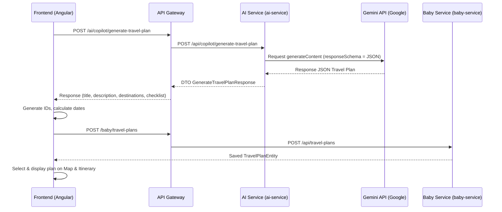

# Tài liệu Thiết kế & Tích hợp: Lập chuyến đi tự động bằng AI (AI Travel Planner)

> **Service**: `ai-service` & `frontend-service`
> **Tính năng**: Lập chuyến đi gia đình hoàn chỉnh bằng AI Copilot (Title, Description, Điểm đến với tọa độ thực tế, Checklist chuẩn bị) và đồng bộ trực tiếp vào cơ sở dữ liệu.
> **Ngày cập nhật**: 2026-06-04

---

## 1. Kiến trúc tổng quan

Tính năng **Tạo chuyến đi tự động bằng AI** được thiết kế dựa trên nguyên tắc tách biệt mối quan tâm (separation of concerns) và giữ cho các dịch vụ độc lập (decoupled):

1. **Frontend Service**:
   - Hiển thị nút "Tạo bằng AI" trên màn hình Travel.
   - Thu thập thông tin từ người dùng: Điểm đến mong muốn, Số ngày đi dự kiến, Ngày bắt đầu, và các Yêu cầu đặc biệt (ví dụ: có trẻ nhỏ).
   - Gửi yêu cầu sinh chuyến đi sang `ai-service`.
   - Nhận kết quả có cấu trúc JSON từ AI, gán `familyId`, tính toán ngày đi và về thực tế, tự sinh các ID cục bộ và gửi yêu cầu `POST /baby/travel-plans` sang `baby-service` để lưu bền vững vào cơ sở dữ liệu PostgreSQL.
   - Hiển thị chuyến đi vừa tạo trực tiếp trên bản đồ và timeline lộ trình.

2. **AI Service (`ai-service`)**:
   - Nhận yêu cầu lập lịch trình từ frontend qua API `/api/copilot/generate-travel-plan`.
   - Sử dụng `GeminiClient` gọi Google Gemini API với cấu trúc `responseSchema` chặt chẽ, bắt buộc AI phản hồi dữ liệu JSON khớp với DTO phản hồi.
   - Trả về dữ liệu chuyến đi hoàn chỉnh cho frontend.

3. **Baby Service (`baby-service`)**:
   - Lưu trữ thông tin chuyến đi, các điểm đến trong lịch trình, và checklist chuẩn bị đồ.
   - Cung cấp các API RESTful CRUD để frontend quản lý chuyến đi thủ công sau khi đã được tạo tự động bởi AI.



---

## 2. Đặc tả API

### API Tạo chuyến đi bằng AI
- **URL**: `/api/copilot/generate-travel-plan` (định tuyến qua gateway: `/ai/copilot/generate-travel-plan`)
- **Method**: `POST`
- **Headers**:
  - `Content-Type`: `application/json`
  - `X-User-Id`: Long
  - `X-Family-Ids`: String
- **Request Body (`GenerateTravelPlanRequest.java`)**:
  ```json
  {
    "familyId": 1,
    "destination": "Đà Lạt",
    "durationDays": 3,
    "startDate": "2026-06-05",
    "preferences": "Gia đình có em bé 8 tháng tuổi, cần đi lại nhẹ nhàng, không leo núi.",
    "language": "vi"
  }
  ```
- **Response Body (`GenerateTravelPlanResponse.java`)**:
  ```json
  {
    "success": true,
    "message": "Travel plan generated successfully",
    "data": {
      "title": "Hành trình nghỉ dưỡng Đà Lạt 3 ngày cùng bé",
      "description": "Chuyến đi thư giãn tại thành phố sương mù, được thiết kế an toàn và thoải mái nhất cho bé 8 tháng tuổi.",
      "destinations": [
        {
          "name": "Hồ Xuân Hương",
          "lat": 11.9422,
          "lng": 108.4452,
          "dayIndex": 1,
          "notes": "Đi dạo ngắm cảnh hồ, không khí trong lành phù hợp cho bé."
        },
        {
          "name": "Chợ Đà Lạt",
          "lat": 11.9427,
          "lng": 108.4363,
          "dayIndex": 1,
          "notes": "Tham quan chợ đêm nhẹ nhàng, mua đồ len giữ ấm."
        }
      ],
      "checklist": [
        {
          "task": "Mang theo tã giấy và bỉm sữa dự phòng",
          "category": "baby"
        },
        {
          "task": "Chuẩn bị xe đẩy gấp gọn cho bé",
          "category": "baby"
        },
        {
          "task": "Giấy khai sinh bản sao của bé và giấy tờ tùy thân của bố mẹ",
          "category": "documents"
        }
      ]
    }
  }
  ```

---

## 3. Hiện thực kỹ thuật

### Backend (`ai-service`)
- **`GenerateTravelPlanRequest` & `GenerateTravelPlanResponse`**: Record DTOs dùng để trao đổi dữ liệu.
- **`GeminiClient.java`**:
  - Định nghĩa prompt chuyên dụng yêu cầu AI lên lịch trình gồm các địa điểm nổi tiếng có tọa độ địa lý thực tế chính xác (vĩ độ `lat` và kinh độ `lng`).
  - Định cấu hình `responseSchema` qua `generationConfig` ép Gemini trả về đúng định dạng mong muốn, giúp hệ thống phân tích cú pháp JSON ổn định và không phát sinh lỗi.
- **`FamilyCopilotService.java`**: Thực hiện kiểm tra phân quyền isolation đa hộ gia đình trước khi chuyển tiếp yêu cầu tới client AI.
- **`AiController.java`**: Expose endpoint nhận request.

### Frontend (Angular)
- **`SuperAppCommandService`**: Thêm phương thức `generateTravelPlan` kết nối với backend.
- **`TravelComponent`**:
  - Tạo Modal để thu thập thông tin đầu vào.
  - Sau khi nhận dữ liệu từ AI Service, tự động gán ID cục bộ cho các thực thể và gửi yêu cầu lưu sang `baby-service`.
  - Tự động kích hoạt thay đổi bản đồ (Leaflet) và timeline hiển thị để mang lại trải nghiệm tương tác trực quan cao cấp (WOW UX).
