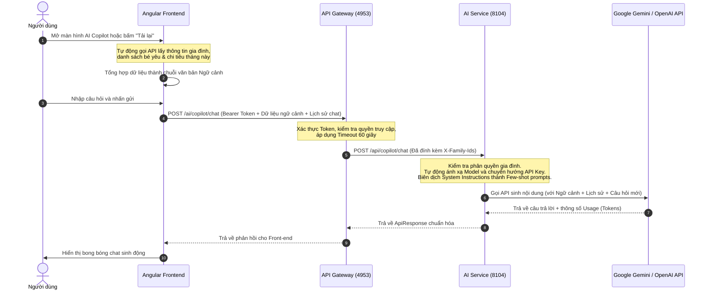

# Tài Liệu Kỹ Thuật Chi Tiết - AI Service & AI Copilot

Tài liệu này cung cấp thông tin chi tiết, toàn diện về kiến trúc, cấu hình, APIs, cơ chế hoạt động và cách vận hành của **AI Service** cùng giao diện **AI Copilot** trong dự án BabySystem.

---

## 1. Tổng Quan Hệ Thống

**AI Service** là một microservice trong hệ sinh thái BabySystem, đóng vai trò cung cấp trợ lý gia đình thông minh **AI Copilot**. Dịch vụ này cho phép người dùng trò chuyện, nhận tư vấn về chế độ dinh dưỡng, bữa ăn, quản lý tài chính, chi tiêu gia đình, chăm sóc bé yêu và tóm tắt tài liệu.

### Thông số kỹ thuật chính:
* **Công nghệ cốt lõi**: Java 17, Spring Boot 3.3.3
* **Thư mục mã nguồn**: `codebase/backend/ai-service`
* **Cổng chạy local**: `8104`
* **Đường dẫn Gateway**: `/ai/**` (được api-gateway chuyển tiếp đến `http://localhost:8104/api/**`)
* **Mô hình AI tích hợp**: OpenAI GPT API & Google Gemini API (tự động nhận diện và định tuyến)
* **Model mặc định**: `gemini-3.5-flash` (tối ưu hóa hiệu năng và chi phí trong năm 2026)

---

## 2. Kiến Trúc & Luồng Dữ Liệu (Data Flow)

Dưới đây là sơ đồ luồng hoạt động khi người dùng tương tác với AI Copilot:



---

## 3. Cấu Hình Hệ Thống & Biến Môi Trường

AI Service sử dụng các biến môi trường để cấu hình linh hoạt mà không cần hardcode thông tin nhạy cảm:

| Tên biến | Kiểu dữ liệu | Giá trị mặc định | Mô tả |
| :--- | :--- | :--- | :--- |
| `PORT` | Integer | `8104` | Cổng chạy dịch vụ AI Service. |
| `OPENAI_API_KEY` | String | **Bắt buộc** | API Key dùng để gọi mô hình. Có thể là OpenAI Key (`sk-...`) hoặc Google Gemini Key (`AIzaSy...`). |
| `OPENAI_MODEL` | String | `gemini-3.5-flash` | Tên mô hình AI sẽ sử dụng. |
| `OPENAI_BASE_URL` | String | `https://api.openai.com` | Base URL của API Provider (tự động chuyển sang Google API nếu là Gemini). |
| `OPENAI_RESPONSES_PATH` | String | `/v1/responses` | Đường dẫn API Endpoint của nhà cung cấp. |
| `OPENAI_MAX_OUTPUT_TOKENS`| Integer | `2048` | Giới hạn số lượng token tối đa trong câu trả lời. |
| `OPENAI_TIMEOUT` | Integer | `30000` (ms) | Thời gian tối đa chờ phản hồi từ API nhà cung cấp (30 giây). |

### Hướng dẫn chạy dịch vụ bằng Powershell:
```powershell
$env:OPENAI_API_KEY = "AIzaSy..." # Nhập API Key thực tế của bạn
cd codebase/backend/ai-service
.\mvnw.cmd spring-boot:run
```

---

## 4. Cơ Chế Tự Động Định Tuyến & Xử Lý Mô Hình Thông Minh

Để đảm bảo hệ thống hoạt động ổn định 100% trong môi trường sản xuất năm 2026, AI Service được trang bị các cơ chế xử lý đặc biệt sau:

### A. Tự động nhận diện Nhà cung cấp (Provider Detection)
Khi dịch vụ nhận được `OPENAI_API_KEY`:
* Nếu Key bắt đầu bằng tiền tố **`AIzaSy`**: Hệ thống tự động xác định đây là **Google Gemini API Key**. Toàn bộ cấu hình endpoint kết nối sẽ được chuyển sang địa chỉ API của Google mà không cần người dùng phải chỉnh sửa `OPENAI_BASE_URL` thủ công.
* Các trường hợp còn lại: Hệ thống mặc định sử dụng **OpenAI API**.

### B. Ánh xạ Mô hình thông minh (Model Mapping)
Để tránh lỗi `404 Not Found` do các mô hình cũ (như `gemini-1.5-flash`) hoặc mô hình OpenAI (`gpt-4`, `gpt-5.4-mini`) không khả dụng hoặc bị hạn chế phân quyền đối với API Key:
* Hệ thống tự động chuyển đổi bất kỳ yêu cầu sử dụng mô hình nào khác sang **`gemini-3.5-flash`** trước khi gửi yêu cầu lên Google Gemini. 
* Cơ chế này đảm bảo tính tương thích ngược và giữ cho dịch vụ luôn hoạt động ổn định.

### C. Giả lập System Instructions cho Gemini API v1 (Workaround)
Phiên bản API stable `v1` của Gemini không hỗ trợ trường cấu hình cấp cao `systemInstruction` (gây ra lỗi `400 Bad Request`). Để giải quyết triệt để vấn đề này mà vẫn đảm bảo AI hiểu rõ các chỉ thị hệ thống (System Prompt):
* Hệ thống tự động chuyển các chỉ dẫn hệ thống thành cấu trúc **Few-shot System Prompt** ở đầu chuỗi lịch sử hội thoại:
  1. Gửi tin nhắn: `"[System Instructions] + <nội dung chỉ dẫn của hệ thống>"` dưới vai trò `user`.
  2. Giả lập phản hồi từ mô hình: `"Understood. I will follow these instructions."` dưới vai trò `model` (hoặc `assistant`).
  3. Tiếp tục đính kèm các tin nhắn chat thực tế của người dùng ở phía sau.
* Kỹ thuật này giúp mô hình Gemini tuân thủ tuyệt đối chỉ thị bảo mật và định dạng của hệ thống mà không vi phạm cấu trúc API stable.

---

## 5. Danh Sách APIs Chi Tiết

### 1. API Trò chuyện (Chat API)
Gửi câu hỏi kèm theo ngữ cảnh và lịch sử trò chuyện để nhận phản hồi từ AI.

* **Method**: `POST`
* **URL**: `/ai/copilot/chat`
* **Headers**:
  * `Authorization: Bearer <JWT_TOKEN>` (Bắt buộc)
  * `Content-Type: application/json`
* **Request Body**:
```json
{
  "familyId": 1,
  "locale": "vi",
  "message": "Gợi ý thực đơn ngày mai cho bé.",
  "context": "=== THÔNG TIN CÁC BÉ ===\n- Bé: Gia Bảo (Sinh ngày: 15/08/2025, Giới tính: Nam)\n\n=== CHI TIÊU THÁNG NÀY ===\n- Tổng chi tiêu: 1,500,000 VND",
  "history": [
    {
      "role": "user",
      "content": "Chào bạn"
    },
    {
      "role": "assistant",
      "content": "Chào bạn, tôi là AI Copilot của BabySystem. Tôi có thể giúp gì cho bạn?"
    }
  ]
}
```
* **Response Body (Thành công - 200 OK)**:
```json
{
  "success": true,
  "message": "Success",
  "data": {
    "answer": "Dựa trên thông tin bé Gia Bảo hiện tại được khoảng 9 tháng tuổi, tôi đề xuất thực đơn ăn dặm như sau: ...",
    "model": "gemini-3.5-flash",
    "responseId": "chatcmpl-12345",
    "usage": {
      "inputTokens": 345,
      "outputTokens": 180,
      "totalTokens": 525
    }
  }
}
```

### 2. API Kiểm tra trạng thái (Status API)
Kiểm tra xem dịch vụ AI đã được cấu hình API Key và model thành công chưa.

* **Method**: `GET`
* **URL**: `/ai/copilot/status`
* **Response Body (200 OK)**:
```json
{
  "success": true,
  "message": "AI Copilot Service is active.",
  "data": {
    "provider": "Google Gemini",
    "configured": true,
    "activeModel": "gemini-3.5-flash"
  }
}
```

---

## 6. Phân Quyền & Bảo Mật Dữ Liệu (Security & Isolation)

* **Xác thực API Gateway**: API Gateway tự động giải mã JWT Token của người dùng, lấy ra danh sách các `familyIds` mà người dùng được phép truy cập và đính kèm vào header `X-Family-Ids` trước khi gửi tới AI Service.
* **Ngăn chặn rò rỉ dữ liệu (Cross-family Protection)**: AI Service thực hiện kiểm tra chéo: nếu `familyId` trong request body không nằm trong danh sách `X-Family-Ids` và người dùng không phải là quản trị viên hệ thống (Admin), yêu cầu sẽ lập tức bị từ chối bằng lỗi `403 Forbidden`. Điều này ngăn chặn triệt để việc người dùng truy cập hoặc hỏi thông tin về dữ liệu gia đình khác.
* **Bảo mật API Key**: Tuyệt đối không lưu trữ API Key trong mã nguồn. Key chỉ được nạp từ biến môi trường của hệ thống vận hành.

---

## 7. Tích Hợp Tự Động Ngữ Cảnh Ở Front-End (Auto-Context UX)

Giao diện **AI Copilot** phía Front-end (`src/app/ai-copilot`) đã được thiết kế lại hoàn toàn nhằm nâng cao trải nghiệm sử dụng:

### Các tính năng nổi bật:
1. **Premium Family Badge**: Loại bỏ ô nhập ID số thô sơ, thay thế bằng badge hiển thị tên gia đình thực tế (ví dụ: `Gia đình Nguyễn`) lấy từ API `/account/families/{id}`.
2. **Auto-Load Context**: Ngay khi mở màn hình, component tự động gọi dịch vụ lấy danh sách bé yêu và chi tiêu hiện tại của tháng, tổng hợp thành cấu trúc văn bản tiếng Việt rõ ràng và điền sẵn vào trường dữ liệu ngữ cảnh. AI sẽ có ngay bối cảnh thực tế để tư vấn chính xác nhất.
3. **Nút Làm mới Ngữ cảnh (Sync)**: Nút **[Tải lại]** cho phép đồng bộ hóa dữ liệu ngữ cảnh ngay lập tức khi gia đình có cập nhật mới (thêm em bé, ghi chép thêm chi tiêu).

---

## 8. Hướng Dẫn Vận Hành & Khắc Phục Sự Cố (Troubleshooting)

### Lỗi 502 Bad Gateway hoặc 503 Service Unavailable khi chat
* **Nguyên nhân**: AI xử lý chậm dẫn đến Gateway ngắt kết nối trước hoặc Circuit Breaker kích hoạt.
* **Cách xử lý**: Đảm bảo cấu hình timeout trong [application.yml](file:///d:/AI-AGENT/BabySystem/codebase/backend/api-gateway/src/main/resources/application.yml) của `api-gateway` đã được thiết lập `response-timeout: 60000` cho route `/ai/**` và `aiServiceGateway` trong `timelimiter.instances` được đặt `timeoutDuration: 60s`.

### Lỗi "Không thể gọi AI Copilot" hiển thị trong khung chat
* **Nguyên nhân**: Dịch vụ `ai-service` chưa được cấu hình API Key hoặc Key bị hết hạn/không hợp lệ.
* **Cách xử lý**: Kiểm tra log chạy của `ai-service`, đảm bảo biến môi trường `OPENAI_API_KEY` đã được nạp chính xác trước khi khởi động.
