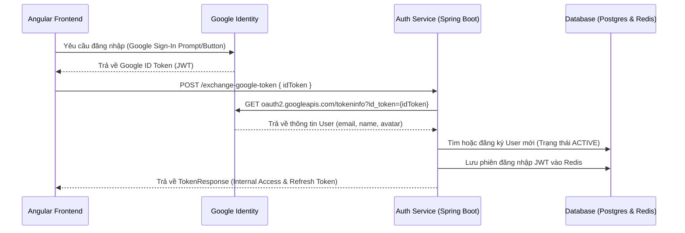

# Cẩm nang Tích hợp & Triển khai Đăng nhập Google & GitHub OAuth2

Tài liệu này cung cấp hướng dẫn chi tiết từ A-Z cách cấu hình, triển khai và vận hành tính năng đăng nhập bằng mạng xã hội (Google & GitHub) áp dụng cơ chế **Token Exchange** bảo mật cho hệ thống **BabySystem**.

---

## 1. Kiến trúc Luồng Xác thực (Token Exchange)

Hệ thống sử dụng cơ chế **Token Exchange**, đảm bảo backend không cần lưu trữ trực tiếp mật khẩu hay thông tin nhạy cảm của bên thứ ba, đồng thời giữ cho phiên làm việc ở Frontend đồng nhất với cơ chế JWT + Redis nội bộ.

### Luồng Google OAuth


---

## 2. Hướng dẫn cấu hình Google Sign-In từ A-Z

Để sử dụng Google làm phương thức đăng nhập, bạn cần tạo OAuth Client ID trên Google Cloud Console.

### Bước A1: Cấu hình Màn hình đồng ý OAuth (OAuth consent screen)
Google yêu cầu bạn khai báo thông tin cơ bản về ứng dụng trước khi tạo Client ID:
1. Truy cập **[Google Cloud Console](https://console.cloud.google.com/)**.
2. Nhìn lên góc trái trên cùng để chọn hoặc tạo mới một Dự án (Project).
3. Tại menu bên trái, tìm và nhấp chọn **APIs & Services** > **OAuth consent screen**.
4. Chọn **User Type** là **External** (cho phép mọi tài khoản Gmail thông thường đăng nhập thử nghiệm) ➡️ Nhấp **Create**.
5. Điền các thông tin bắt buộc:
   - **App name**: `BabySystem`
   - **User support email**: Chọn email quản trị của bạn.
   - **Developer contact information** (dưới cùng): Nhập email của bạn.
6. Nhấp **Save and Continue** qua các bước sau (Scopes, Test Users) cho đến khi quay về Dashboard.

### Bước A2: Tạo OAuth 2.0 Client ID
1. Tại menu bên trái, nhấp chọn **Credentials** (Thông tin xác thực).
2. Nhấp nút **`+ Create credentials`** ở trên cùng ➡️ chọn **OAuth client ID**.
3. Cấu hình các thông số sau:
   - **Application type**: `Web application`
   - **Name**: `BabySystem Web Client`
   - **Authorized JavaScript origins**: Nhấp **+ ADD URI** và điền chính xác:
     `http://localhost:4200` *(Lưu ý: Không để dấu gạch chéo `/` ở cuối)*
   - **Authorized redirect URIs**: Nhấp **+ ADD URI** và điền chính xác:
     `http://localhost:4200` và `http://localhost:4200/app/login`
4. Nhấp **Create**. Một hộp thoại sẽ hiện ra chứa **Client ID** và **Client Secret** của bạn. Hãy lưu chúng lại.

---

## 3. Hướng dẫn cấu hình GitHub OAuth

Đối với GitHub, bạn sẽ tạo một ứng dụng OAuth để lấy Client ID và Client Secret:
1. Truy cập **GitHub** > nhấp vào Avatar góc phải trên ➡️ chọn **Settings**.
2. Tại menu bên trái dưới cùng, nhấp chọn **Developer Settings** ➡️ chọn **OAuth Apps**.
3. Nhấp nút **Register a new application** (hoặc **New OAuth App**).
4. Điền các thông tin sau:
   - **Application name**: `BabySystem`
   - **Homepage URL**: `http://localhost:4200`
   - **Authorization callback URL**: `http://localhost:4200/app/login`
5. Nhấp **Register application**.
6. Hệ thống sẽ cấp cho bạn **Client ID**. Bạn hãy nhấp vào nút **Generate a new client secret** để nhận **Client Secret**.

---

## 4. Cấu hình Backend qua HashiCorp Vault (Bảo mật Cao)

Hệ thống sử dụng **Spring Cloud Vault** để quản lý cấu hình tập trung và bảo mật, thay vì hardcode (viết cứng) thông tin Client ID nhạy cảm vào file cấu hình `application-dev.yml` tĩnh.

### Cách nạp cấu hình vào Vault KV v2:
Mặc định dịch vụ `authentication-service` sẽ đọc cấu hình từ path `/secret/authentication-service` với profile `dev`. Do Vault của bạn đang dùng KV Engine Version 2, bạn cần ghi cấu hình thông qua API v2.

#### 💻 Câu lệnh ghi cấu hình bằng `curl` ở Local:
Mở cửa sổ Command Prompt hoặc PowerShell của bạn và chạy lệnh sau (đảm bảo dịch vụ Vault tại cổng `8200` đang chạy):

##### 1. Cấu hình Google Client ID:
```bash
curl.exe -X POST -H "X-Vault-Token: root" -H "Content-Type: application/json" -d "{\"data\":{\"oauth2.google.client-id\":\"793208159346-4ucpps18skm5kcq7ppp4uke1ci38l85q.apps.googleusercontent.com\"}}" http://localhost:8200/v1/secret/data/authentication-service
```

##### 2. Cấu hình GitHub Credentials:
```bash
curl.exe -X POST -H "X-Vault-Token: root" -H "Content-Type: application/json" -d "{\"data\":{\"oauth2.github.client-id\":\"YOUR_GITHUB_CLIENT_ID\",\"oauth2.github.client-secret\":\"YOUR_GITHUB_SECRET\"}}" http://localhost:8200/v1/secret/data/authentication-service
```

> [!IMPORTANT]
> Sau khi ghi thông tin cấu hình thành công vào Vault, bạn **bắt buộc phải khởi động lại dịch vụ `authentication-service` (cổng 8081)** để nó kết nối Vault và nạp lại cấu hình runtime mới nhất!

### 🖥️ Cấu hình trực quan qua giao diện Web UI (Khuyên dùng)

Nếu không muốn sử dụng các câu lệnh Terminal cồng kềnh, bạn hoàn toàn có thể cấu hình trực tiếp và trực quan trên giao diện Web UI của Vault:

1. Đăng nhập vào trang quản trị Vault tại: **`http://localhost:8200`**
   - Chọn phương thức đăng nhập (Method) là **Token**.
   - Nhập Token là **`root`** và bấm **Sign In**.
2. Đi thẳng tới đường dẫn quản lý danh sách KV Secrets:
   👉 Link trực tiếp: **[http://localhost:8200/ui/vault/secrets/secret/kv/list](http://localhost:8200/ui/vault/secrets/secret/kv/list)**
3. Tạo mới hoặc chỉnh sửa các Path cấu hình:
   - **Tạo cấu hình chung**: Nhấn nút **Create secret**, điền *Path for this secret* là **`authentication-service`**.
   - **Tạo cấu hình cho profile Dev**: Nhấn nút **Create secret**, điền *Path for this secret* là **`authentication-service,dev`**.
4. Chuyển đổi công tắc sang chế độ **JSON** (ở phía trên bảng nhập Key/Value) và dán đoạn mã cấu hình hoàn chỉnh dưới đây vào:
   ```json
   {
     "oauth2.google.client-id": "793208159346-4ucpps18skm5kcq7ppp4uke1ci38l85q.apps.googleusercontent.com",
     "oauth2.github.client-id": "Ov23liwCFxVfCS2HTgbN",
     "oauth2.github.client-secret": "7559c717069caeb3bae254ef5d174839dcd06071",
     "GOOGLE_CLIENT_ID": "793208159346-4ucpps18skm5kcq7ppp4uke1ci38l85q.apps.googleusercontent.com",
     "GITHUB_CLIENT_ID": "Ov23liwCFxVfCS2HTgbN",
     "GITHUB_CLIENT_SECRET": "7559c717069caeb3bae254ef5d174839dcd06071"
   }
   ```
5. Nhấn **Save** (Lưu) ở dưới cùng để hoàn tất.

---

## 5. Cấu hình Frontend động qua Environment Variable (ENV)

Để ứng dụng Frontend (Angular) có khả năng thay đổi cấu hình linh hoạt khi deploy (bằng Docker/Kubernetes) mà không cần biên dịch lại toàn bộ mã nguồn, cấu hình được triển khai qua biến môi trường toàn cục `window.env`.

### Mã nguồn cấu hình tại [api.constant.ts](file:///d:/AI-AGENT/BabySystem/codebase/frontend/src/app/shared/constants/api.constant.ts):
```typescript
export const API_CONFIG = {
    ...
    GOOGLE_CLIENT_ID: (window as any).env?.GOOGLE_CLIENT_ID || '793208159346-4ucpps18skm5kcq7ppp4uke1ci38l85q.apps.googleusercontent.com',
    GITHUB_CLIENT_ID: (window as any).env?.GITHUB_CLIENT_ID || 'Ov23ctfakegithubclientid'
};
```

### 🐳 Cách deploy động với Docker & Nginx:
Trong script entrypoint của Docker container (hoặc trước khi khởi động Nginx server trên production), bạn chỉ cần chạy lệnh sau để chèn cấu hình ENV trực tiếp vào `index.html`:

```bash
#!/bin/sh
# Chèn cấu hình từ biến môi trường của Docker vào file index.html
echo "<script>window.env = { GOOGLE_CLIENT_ID: '${GOOGLE_CLIENT_ID}', GITHUB_CLIENT_ID: '${GITHUB_CLIENT_ID}' };</script>" >> /usr/share/nginx/html/index.html

# Bắt đầu chạy Nginx
nginx -g "daemon off;"
```

---

## 6. Cẩm nang Khắc phục lỗi (Troubleshooting Guide)

| Lỗi thường gặp | Nguyên nhân chính | Cách xử lý nhanh |
| :--- | :--- | :--- |
| **`Lỗi 403 Forbidden` khi gửi request exchange token** | Dịch vụ API Gateway (cổng 4953) chặn do API mới chưa được đưa vào danh sách trắng (Whitelist public). | Kiểm tra file [ApiPermissionFilter.java](file:///d:/AI-AGENT/BabySystem/codebase/backend/api-gateway/src/main/java/vn/logistic/apigateway/config/ApiPermissionFilter.java). Đảm bảo đã có các path `/auth/exchange-google-token` và `/auth/exchange-github-token` trong `PUBLIC_PATH_PREFIXES`. Khởi động lại **API Gateway**. |
| **`Lỗi 401 Unauthorized` từ Authentication Service** | 1. Dịch vụ `authentication-service` chưa khởi động lại để nạp Client ID mới từ Vault.<br>2. Google Client ID trong Vault bị lệch so với token GSI. | 1. Ghi đúng Client ID vào Vault.<br>2. **Khởi động lại** dịch vụ `authentication-service` (cổng 8081) để nó fetch lại dữ liệu từ Vault. |
| **`The given origin is not allowed...` hiển thị ở Console** | Google Cloud Console chưa nhận dạng hoặc chưa đồng bộ xong Javascript Origin của bạn. | 1. Kiểm tra kĩ xem mục *Authorized JavaScript origins* trên Google Console có đúng là `http://localhost:4200` (không có `/` ở cuối) không.<br>2. Chờ 5-10 phút để Google đồng bộ.<br>3. **Mở tab ẩn danh mới** để thử lại nhằm tránh cache token lỗi của trình duyệt cũ. |
