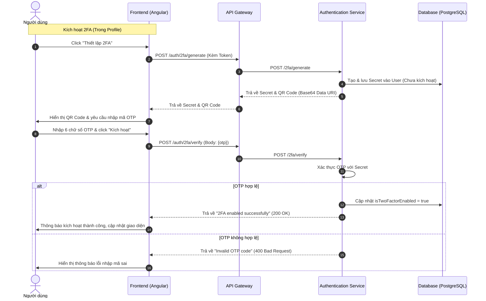

# Authentication Service - Two-Factor Authentication (2FA)

Tài liệu thiết kế chi tiết về việc tích hợp tính năng Xác thực 2 bước (2FA) cho tất cả các vai trò (roles) trong hệ thống BabySystem.

---

## 1. Kiến trúc hệ thống 2FA

Hệ thống sử dụng cơ chế **TOTP (Time-Based One-Time Password)** dựa trên thuật toán SHA1, chu kỳ 30 giây, mã gồm 6 chữ số. 2FA được áp dụng đồng nhất cho mọi tài khoản người dùng không phân biệt vai trò (Admin, User, Caregiver, v.v.) vì thuộc tính bảo mật này nằm trực tiếp trên thực thể `User`.

> [!NOTE]
> Để phòng tránh các lỗi lệch múi giờ hệ thống (Time Drift) rất phổ biến trong môi trường phát triển local giữa máy tính chạy backend và thiết bị di động của người dùng (chứa ứng dụng Authenticator), hệ thống đã nới rộng độ lệch thời gian cho phép (allowed time period discrepancy) lên **5 chu kỳ (tương đương 150 giây / 2.5 phút)** trong cả hai lớp xác thực (`TwoFactorServiceImpl` lúc bật 2FA và `AuthenticationServiceImp` lúc đăng nhập). Server cũng tự động in log chi tiết (`DEBUG OTP` & `DEBUG LOGIN OTP`) cho phép so sánh trực quan mã OTP mong đợi của Server với mã người dùng nhập để nhanh chóng khắc phục sự cố.

### Sơ đồ luồng hoạt động



---

## 2. Thiết kế API Backend

Tất cả các API được định nghĩa trong `TwoFactorController` thuộc `authentication-service` và được định tuyến qua API Gateway dưới tiền tố `/auth`.

### 2.1. Lấy trạng thái 2FA của tài khoản hiện tại
* **Endpoint**: `GET /auth/2fa/status`
* **Headers**: `Authorization: Bearer <token>`
* **Mô tả**: Trả về `true` nếu tài khoản đã bật 2FA, ngược lại trả về `false`.

### 2.2. Khởi tạo mã Secret & QR Code thiết lập
* **Endpoint**: `POST /auth/2fa/generate`
* **Headers**: `Authorization: Bearer <token>`
* **Mô tả**: Sinh mã bí mật mới, lưu tạm vào DB và kết xuất ảnh QR Code dạng Base64 Data URI để quét.
* **Response Body (`TwoFactorResponse`)**:
```json
{
  "secret": "JBSWY3DPEHPK3PXP",
  "qrCodeUrl": "data:image/png;base64,iVBORw0KGgoAAA..."
}
```

### 2.3. Xác thực OTP để kích hoạt 2FA
* **Endpoint**: `POST /auth/2fa/verify`
* **Headers**: `Authorization: Bearer <token>`
* **Request Body (`TwoFactorRequest`)**:
```json
{
  "otp": "123456"
}
```
* **Mô tả**: Backend kiểm tra tính hợp lệ của mã OTP. Nếu đúng, cập nhật cột `is_two_factor_enabled` thành `true` trong cơ sở dữ liệu.

### 2.4. Tắt xác thực 2 bước
* **Endpoint**: `POST /auth/2fa/disable`
* **Headers**: `Authorization: Bearer <token>`
* **Mô tả**: Tắt tính năng 2FA cho người dùng và xóa mã Secret của tài khoản.

---

## 3. Quy trình Đăng nhập tích hợp 2FA

Khi người dùng thực hiện đăng nhập bình thường bằng Username/Password qua API `POST /auth/access-token`:

1. Backend kiểm tra thông tin tài khoản.
2. Nếu tài khoản chưa bật 2FA (`isTwoFactorEnabled == false`), đăng nhập thành công và trả về TokenResponse.
3. Nếu tài khoản đã bật 2FA (`isTwoFactorEnabled == true`):
   - Nếu request đăng nhập **không** gửi kèm mã OTP, backend ném lỗi `401 Unauthorized` với nội dung `"OTP is required for this account"`.
   - Frontend bắt lỗi này, hiển thị ô nhập mã OTP trên màn hình đăng nhập.
   - Khi người dùng nhập OTP và click Đăng nhập lại, frontend gửi kèm `otp` trong body request login.
   - Backend xác thực OTP, nếu hợp lệ sẽ cấp Access Token.

---

## 4. Thiết kế Giao diện người dùng (UI/UX)

Áp dụng chặt chẽ **Web Design Backbone Rule** để đảm bảo giao diện cao cấp và có chiều sâu.

### 4.1. Vị trí thiết lập
Dòng thiết lập 2FA được đặt trong card **Bảo mật** (Security) tại trang Profile cá nhân (`/app/profile`).

### 4.2. Modal Cài đặt 2FA
Giao diện Modal tuân theo layout 3 bước của Mock-up thiết kế:
* **Bước 1**: Icon hướng dẫn sinh động cùng chỉ dẫn tải app Google Authenticator/Microsoft Authenticator.
* **Bước 2**: Khung hiển thị QR code bo góc mềm mại (`border-radius: 16px`), bóng mờ nhẹ, bao bọc mã QR rõ nét.
* **Bước 3**: 6 ô nhập số riêng biệt (hoặc 1 ô nhập liệu 6 chữ số có font chữ lớn và khoảng cách ký tự rộng) kèm đồng hồ đếm ngược `Remaining time: 30s` hoạt động thời gian thực.
* **Chân trang (Footer)**: 
  * Nút "Huỷ bỏ" (`.btn-user-outline`).
  * Nút "Kích hoạt xác thực 2 bước" (`.btn-user-primary`).

### 4.3. Đa ngôn ngữ (i18n)
Tất cả các chuỗi văn bản trên giao diện 2FA được tổ chức tại thư mục dịch riêng biệt:
* `codebase/frontend/public/i18n/app/profile/vi.json`
* `codebase/frontend/public/i18n/app/profile/en.json`

Sau đó, đồng bộ tự động vào file cha thông qua script compile.

---

## 5. Cấu hình bảo mật API Gateway (Bypass Phân quyền động)

Do hệ thống sử dụng cơ chế phân quyền động dựa trên cơ sở dữ liệu (`ApiPermissionFilter` trong `api-gateway`), các API tự phục vụ cá nhân như `/auth/2fa/**` đã được bổ sung vào danh sách ngoại lệ (Exception list) dành cho người dùng có token Bearer hợp lệ:

```java
// File: ApiPermissionFilter.java
// Bổ sung ngoại lệ: Cho phép mọi người dùng đã đăng nhập có token hợp lệ truy cập các API thiết lập 2FA cá nhân
if (antPathMatcher.match("/auth/2fa/**", requestPath)) {
    return reactor.util.function.Tuples.of(AuthDecision.allowed("BEARER"), mutatedExchange);
}
```

Điều này giúp tất cả các tài khoản bất kể vai trò (Admin, User, Caregiver) đều có thể tự cấu hình 2FA cho tài khoản của chính mình một cách trơn tru mà không cần can thiệp vào cơ sở dữ liệu phân quyền API động của hệ thống.

