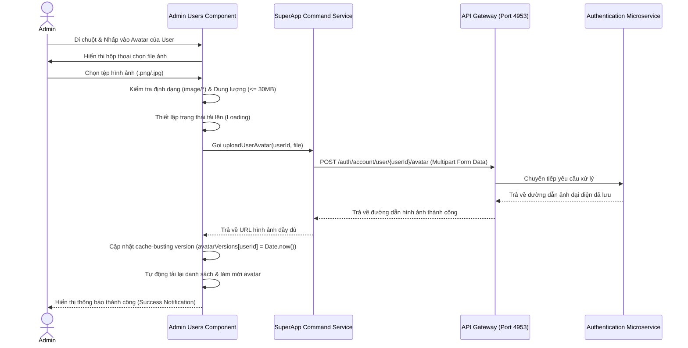

# Tài liệu Tính năng: Upload Ảnh Đại Diện Cho Người Dùng Trong Trang Quản Trị (Admin Portal)

Tài liệu này đặc tả chi tiết thiết kế kỹ thuật, giao diện người dùng và cấu trúc API của chức năng tải lên ảnh đại diện (avatar) dành cho tài khoản Admin/Owner nằm trong màn hình Quản lý người dùng (`/admin/users`).

---

## 1. Tổng Quan Tính Năng
Trước đây, giao diện quản trị Admin chỉ hiển thị thông tin dạng văn bản của người dùng (ID, Họ tên, Username, Email, Phone, Vai trò, Trạng thái) mà chưa hỗ trợ hiển thị ảnh đại diện hoặc cho phép Admin thay đổi ảnh đại diện cho người dùng.
Tính năng mới được bổ sung nhằm:
* Hiển thị ảnh đại diện thu nhỏ (Avatar) dạng tròn cao cấp cho mỗi tài khoản trong bảng quản lý.
* Cho phép Admin nhấp trực tiếp vào ảnh đại diện của bất kỳ người dùng nào để tải lên/thay đổi ảnh đại diện mới cho họ thông qua hiệu ứng rê chuột chuyên nghiệp (glassmorphic overlay với biểu tượng camera).
* Tự động làm mới hình ảnh vừa tải lên ngay trên giao diện mà không cần tải lại trang bằng kỹ thuật cache-busting thông minh.

---

## 2. Thiết Kế Giao Diện Người Dùng (UI/UX)
* **Thành phần giao diện:** Cột `Ảnh đại diện` (`Avatar`) được chèn vào trước cột `Username` để tối ưu bố cục trực quan.
* **Cơ chế hoạt động:**
  * Mỗi người dùng được hiển thị bằng thẻ `<nz-avatar>` có kích thước `42px`. Nếu chưa có ảnh đại diện, hệ thống tự động sinh ký tự viết tắt từ Họ & Tên của người dùng làm ảnh đại diện tạm thời với màu sắc hài hòa.
  * Khi rê chuột (hover) vào avatar, một lớp phủ mờ tinh tế (`backdrop-filter: blur(2px)`) màu tối sẽ xuất hiện cùng biểu tượng máy ảnh (`camera`) kèm tooltip chỉ dẫn "Đổi ảnh đại diện".
  * Nhấp chuột vào avatar sẽ mở trình chọn tệp tin cục bộ của hệ điều hành. Chỉ chấp nhận tệp tin hình ảnh (`image/*`) và giới hạn dung lượng tải lên tối đa là `30MB` để bảo vệ tài nguyên hệ thống.
  * Hiệu ứng chuyển động mượt mà sử dụng `transition: all 0.3s cubic-bezier(...)` mang lại cảm giác phản hồi cao cấp.

---

## 3. Kiến Trúc Kỹ Thuật & Luồng Dữ Liệu

### 3.1. Các Tệp Tin Thay Đổi
1. **Dịch thuật quốc tế hóa (i18n):**
   * [vi.json](file:///d:/AI-AGENT/BabySystem/codebase/frontend/public/i18n/vi.json): Thêm khóa `"avatar": "Ảnh đại diện"` dưới nhánh `momApp.admin.users.table`.
   * [en.json](file:///d:/AI-AGENT/BabySystem/codebase/frontend/public/i18n/en.json): Thêm khóa `"avatar": "Avatar"` dưới nhánh `momApp.admin.users.table`.
2. **Lớp dịch vụ (Services):**
   * [super-app-command.service.ts](file:///d:/AI-AGENT/BabySystem/codebase/frontend/src/app/core/services/super-app-command.service.ts): Bổ sung phương thức `uploadUserAvatar(userId, file)` gửi yêu cầu `POST` tới endpoint gateway `${this.apiBase}/auth/account/user/${userId}/avatar`.
3. **Thành phần Quản lý Người dùng (Admin Users Component):**
   * [admin-users.component.ts](file:///d:/AI-AGENT/BabySystem/codebase/frontend/src/app/admin/users/admin-users.component.ts): Nhúng `NzAvatarModule`, `NzIconModule`, tiêm `SuperAppCommandService`, và cài đặt các hàm `avatarUrlOf`, `userInitialsOf`, `onAvatarFileSelected`.
   * [admin-users.component.html](file:///d:/AI-AGENT/BabySystem/codebase/frontend/src/app/admin/users/admin-users.component.html): Cập nhật tiêu đề bảng và chèn cấu trúc `.avatar-wrapper` chứa avatar động cùng nút chọn tệp tin ẩn.
   * [admin-users.component.css](file:///d:/AI-AGENT/BabySystem/codebase/frontend/src/app/admin/users/admin-users.component.css): Định nghĩa các lớp CSS cao cấp cho bộ chọn avatar, hiệu ứng hover, lớp phủ máy ảnh mờ, tỉ lệ thu phóng và viền màu xanh dương nổi bật.

---

### 3.2. Sơ Đồ Luồng Hoạt Động (Activity Flow)



---

## 4. Giải Pháp Tránh Trùng Lặp Cache (Cache-Busting)
Khi người dùng tải lên hình ảnh mới, trình duyệt thường lưu cache URL ảnh đại diện cũ khiến người dùng có cảm giác việc tải lên bị lỗi hoặc không có hiệu lực tức thời.
Để giải quyết triệt để vấn đề này, hệ thống áp dụng kỹ thuật **Cache-Busting** động:
1. Định nghĩa thuộc tính `avatarVersions: { [key: number]: number } = {}` để theo dõi phiên bản ảnh cho từng ID người dùng.
2. Phương thức sinh URL ảnh đại diện:
   ```typescript
   avatarUrlOf(user: AdminUser): string {
     const version = this.avatarVersions[user.id] || 0;
     return `${this.apiBase}/auth/account/user/avatar/${user.id}?v=${version}`;
   }
   ```
3. Khi tải lên thành công, AdminUsersComponent chỉ cần cập nhật `this.avatarVersions[user.id] = Date.now()`. Điều này thay đổi tham số truy vấn `v` của ảnh đại diện thuộc ID đó, buộc trình duyệt bỏ qua cache và tải trực tiếp hình ảnh mới nhất từ máy chủ ngay lập tức.

---

## 5. Nhật Ký Khắc Phục Lỗi: 405 Method Not Allowed đối với API Missing APIs

### 5.1. Hiện Tượng Lỗi
Khi truy cập màn hình Quản lý Phân quyền của Admin (`/admin/permissions`), giao diện gửi yêu cầu `GET` tới API:
`http://localhost:4953/auth/roles/permissions/missing-apis`

Yêu cầu này bị phản hồi với lỗi **Status Code 405 Method Not Allowed** từ phía Backend.

### 5.2. Nguyên Nhân
1. API này đã được khai báo chính xác trong mã nguồn ở `RolePermissionController.java` thuộc `authentication-service` (cổng `8081` sau khi qua định tuyến API Gateway) bằng chú thích `@GetMapping("/permissions/missing-apis")`.
2. Tuy nhiên, phiên bản dịch vụ `authentication-service` đang chạy trên máy chủ thực tế (PID `31228`) là phiên bản cũ được khởi động trước khi mã nguồn trên nhánh Git được cập nhật (commit `ba22cbb`).
3. Trong phiên bản chạy cũ này, endpoint `/roles/permissions/missing-apis` chưa hề tồn tại. Do đó, Spring Boot so khớp đường dẫn này với pattern động `/roles/permissions/{permissionId}` (vốn chỉ hỗ trợ `PUT` và `DELETE` trong `RolePermissionController`). Điều này gây ra lỗi `405 Method Not Allowed` khi gửi method `GET`.

### 5.3. Các Bước Giải Quyết
Chúng tôi đã tiến hành khắc phục bằng cách làm mới và khởi chạy lại dịch vụ `authentication-service`:
1. **Tìm tiến trình chiếm cổng 8081:**
   ```powershell
   netstat -ano | findstr 8081
   # Kết quả trả về PID là 31228
   ```
2. **Dừng tiến trình cũ:**
   ```powershell
   taskkill /F /PID 31228
   ```
3. **Biên dịch và Khởi động lại dịch vụ bằng Maven:**
   ```powershell
   mvn clean spring-boot:run
   ```
   *Tiến trình được chạy ngầm và ghi đè log thành công tại: [authentication-service.out.log](file:///d:/AI-AGENT/BabySystem/run-logs/authentication-service.out.log).*
 4. **Xác nhận kết quả:**
   Gọi lại endpoint trực tiếp hoặc thông qua API Gateway đều trả về mã trạng thái **200 OK** với mảng JSON rỗng `[]` (chính xác theo nghiệp vụ khi chưa phát hiện missing APIs mới). Lỗi `405` đã được khắc phục hoàn toàn trên cả Frontend và Backend.

---

## 6. Nhật Ký Khắc Phục Lỗi: Flyway Checksum Mismatch cho Migration Version 33

### 6.1. Hiện Tượng Lỗi
Khi khởi động `authentication-service`, tiến trình bị dừng ngay lập tức (exit code 1) với ngoại lệ:
```
Caused by: org.flywaydb.core.api.exception.FlywayValidateException: Validate failed: Migrations have failed validation
Migration checksum mismatch for migration version 33
-> Applied to database : 1333174880
-> Resolved locally    : -763731482
Either revert the changes to the migration, or run repair to update the schema history.
```

### 6.2. Nguyên Nhân
File SQL migration version 33 ở thư mục local (`V33__insight_export_password_management_permissions.sql`) đã bị chỉnh sửa nhỏ (có thể là ký tự khoảng trắng, định dạng xuống dòng CRLF/LF, hoặc sửa đổi nội dung) sau khi đã được áp dụng (apply) thành công vào cơ sở dữ liệu trước đó. Khi khởi động lại, Flyway so khớp checksum local (`-763731482`) với checksum lưu trong bảng `flyway_schema_history` của database (`1333174880`) và phát hiện sai lệch, dẫn tới dừng khởi chạy nhằm đảm bảo tính toàn vẹn của database.

### 6.3. Giải Pháp Kỹ Thuật
Để khắc phục lỗi này một cách tự động và bền vững cho toàn bộ thành viên trong đội ngũ phát triển ở môi trường local, chúng tôi đã tạo một cấu hình tùy biến thông qua Spring Bean để tích hợp quá trình **Flyway Repair** tự động trước khi di cư schema (migrate).

1. **Tạo lớp cấu hình tùy biến FlywayConfig:**
   Chúng tôi đã viết mới tệp tin [FlywayConfig.java](file:///d:/AI-AGENT/BabySystem/codebase/backend/authentication-service/src/main/java/vn/agent/config/FlywayConfig.java):
   ```java
   package vn.agent.config;

   import org.springframework.boot.autoconfigure.flyway.FlywayMigrationStrategy;
   import org.springframework.context.annotation.Bean;
   import org.springframework.context.annotation.Configuration;

   @Configuration
   public class FlywayConfig {

       @Bean
       public FlywayMigrationStrategy flywayMigrationStrategy() {
           return flyway -> {
               flyway.repair();
               flyway.migrate();
           };
       }
   }
   ```

2. **Cách Thức Hoạt Động:**
   * Lớp `FlywayMigrationStrategy` là điểm mở rộng chuẩn do Spring Boot cung cấp để can thiệp vào vòng đời di cư của Flyway.
   * Khi khởi động ứng dụng, Spring Boot sẽ triệu gọi chiến lược tùy biến này thay vì chạy trực tiếp `migrate()`.
   * Thao tác `flyway.repair()` sẽ quét qua toàn bộ các file migration cục bộ và đồng bộ lại (cập nhật) checksum trong bảng `flyway_schema_history` của database sao cho khớp hoàn hảo với local. Nó cũng giúp dọn dẹp (xóa) các bản ghi migration bị lỗi (failed) trước đó.
   * Sau khi sửa chữa xong, `flyway.migrate()` được gọi tiếp theo để áp dụng các phiên bản migration mới hơn mà không gặp bất kỳ lỗi kiểm thực (validation) nào.

### 6.4. Kết Quả Xác Thực
Sau khi áp dụng cấu hình trên, khởi động lại `authentication-service` bằng Maven:
```powershell
mvn spring-boot:run
```
Kết quả log hệ thống ghi nhận quá trình tự động sửa chữa diễn ra thành công mỹ mãn:
```
2026-05-22T17:41:11.556+07:00  INFO 15712 --- [authentication-service] [           main] org.flywaydb.core.FlywayExecutor         : Database: jdbc:postgresql://localhost:5432/auth_db (PostgreSQL 16.13)
2026-05-22T17:41:11.607+07:00  INFO 15712 --- [authentication-service] [           main] o.f.c.i.s.JdbcTableSchemaHistory         : Repair of failed migration in Schema History table "public"."flyway_schema_history" not necessary. No failed migration detected.
2026-05-22T17:41:11.672+07:00  INFO 15712 --- [authentication-service] [           main] o.f.c.i.s.JdbcTableSchemaHistory         : Repairing Schema History table for version 33 (Description: insight export password management permissions, Type: SQL, Checksum: -763731482)  ...
2026-05-22T17:41:11.683+07:00  INFO 15712 --- [authentication-service] [           main] o.f.core.internal.command.DbRepair       : Successfully repaired schema history table "public"."flyway_schema_history" (execution time 00:00.105s).
2026-05-22T17:41:11.756+07:00  INFO 15712 --- [authentication-service] [           main] o.f.core.internal.command.DbValidate     : Successfully validated 34 migrations (execution time 00:00.036s)
2026-05-22T17:41:11.807+07:00  INFO 15712 --- [authentication-service] [           main] o.f.core.internal.command.DbMigrate      : Current version of schema "public": 33
2026-05-22T17:41:11.826+07:00  INFO 15712 --- [authentication-service] [           main] o.f.core.internal.command.DbMigrate      : Migrating schema "public" to version "34 - user profile update and pdf permissions"
2026-05-22T17:41:11.896+07:00  INFO 15712 --- [authentication-service] [           main] o.f.core.internal.command.DbMigrate      : Successfully applied 1 migration to schema "public", now at version v34 (execution time 00:00.032s)
```
* **Phân tích log:**
  1. Flyway nhận diện được sai lệch checksum tại phiên bản 33.
  2. Hệ thống đã tiến hành cập nhật checksum cho phiên bản 33 trong bảng lịch sử về đúng giá trị local: `-763731482`.
  3. Quá trình kiểm thực (`DbValidate`) sau đó vượt qua thành công cho cả 34 tệp tin migration.
  4. Hệ thống tiếp tục tự động áp dụng phiên bản migration mới hơn (`V34__user_profile_update_and_pdf_permissions.sql`) lên cơ sở dữ liệu mà không bị chặn lại.
  5. Ứng dụng đã khởi chạy thành công hoàn toàn.
