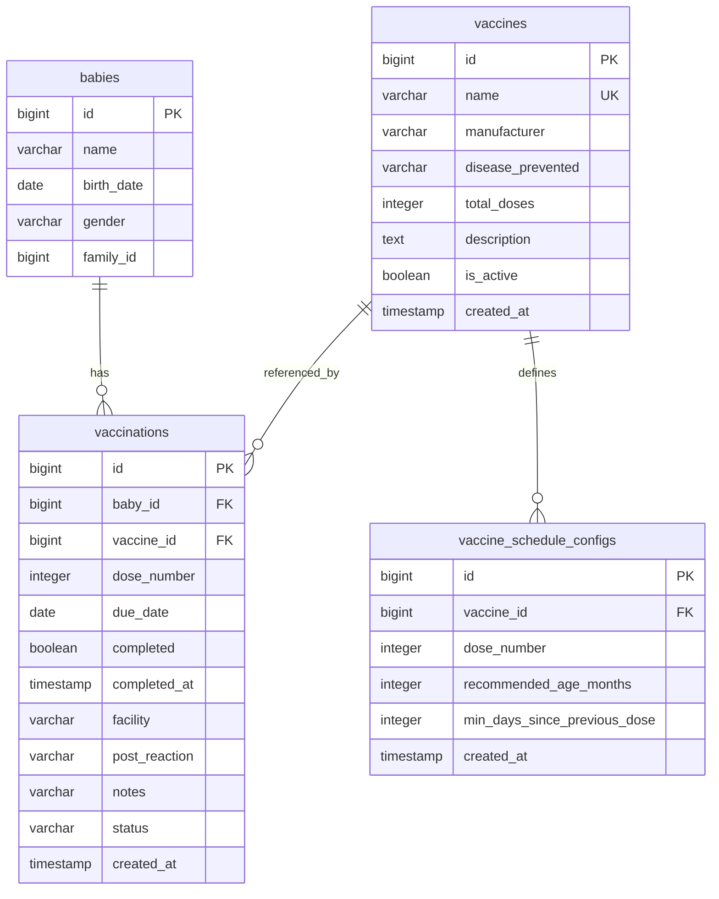
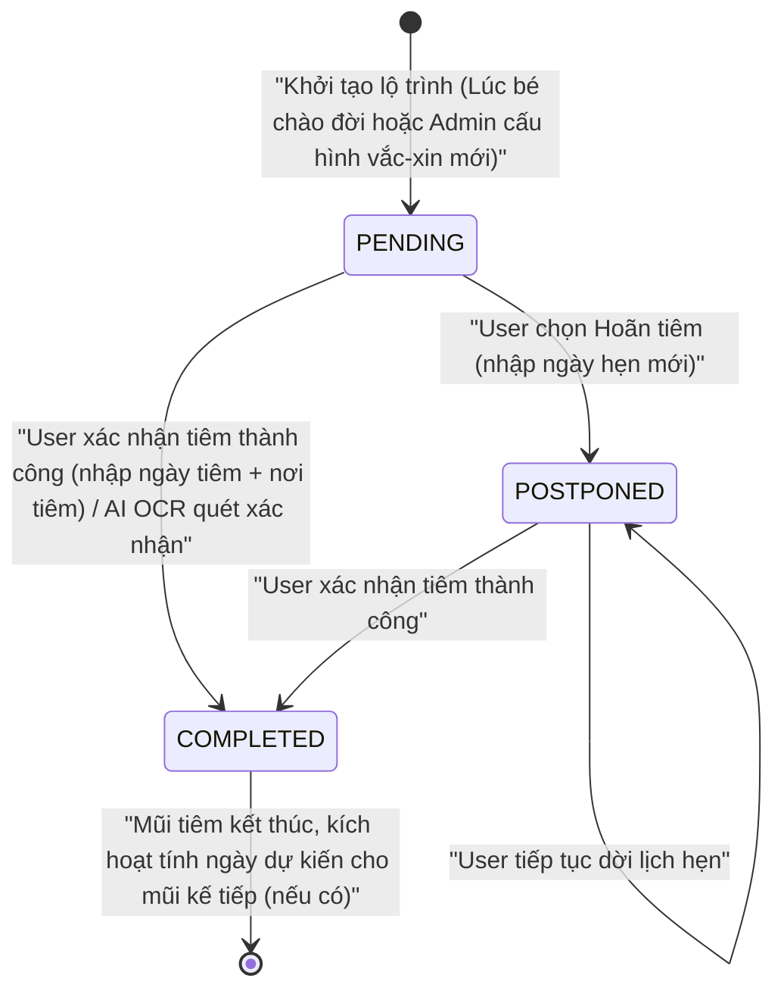

# Data Model: Baby Vaccination Tracker

**Feature**: Baby Vaccination Tracker
**Date**: 2026-07-26
**Status**: Completed

## 1. Sơ đồ Thực thể (Database Schema)

Dưới đây là chi tiết các bảng được tạo mới và cập nhật trong cơ sở dữ liệu `baby_db` của microservice `baby-service`.

---

## 2. Chi tiết các Bảng dữ liệu

### 2.1 Bảng `vaccines` (Danh mục Vắc-xin)
Bảng do Admin quản lý để cấu hình danh mục vắc-xin dùng chung cho toàn hệ thống.

| Tên trường | Kiểu dữ liệu | Ràng buộc | Mô tả |
| :--- | :--- | :--- | :--- |
| `id` | `bigint` | PK, Auto Increment | Khóa chính |
| `name` | `varchar(160)` | Unique, Not Null | Tên vắc-xin (Ví dụ: "Infanrix Hexa 6-in-1") |
| `manufacturer` | `varchar(120)` | Nullable | Nhà sản xuất (Ví dụ: "GSK") |
| `disease_prevented` | `varchar(255)` | Not Null | Bệnh phòng ngừa (Ví dụ: "Bạch hầu, Ho gà, Uốn ván, Bại liệt, Viêm gan B, Hib") |
| `total_doses` | `integer` | Not Null, Default 1 | Tổng số mũi tiêm yêu cầu |
| `description` | `text` | Nullable | Mô tả chi tiết về vắc-xin |
| `is_active` | `boolean` | Not Null, Default true | Trạng thái hoạt động (cho phép ẩn vắc-xin cũ) |
| `created_at` | `timestamp` | Not Null | Thời gian tạo bản ghi |

---

### 2.2 Bảng `vaccine_schedule_configs` (Cấu hình lộ trình tiêm)
Bảng cấu hình các mốc tiêm chủng khuyến khuyến cáo của từng loại vắc-xin.

| Tên trường | Kiểu dữ liệu | Ràng buộc | Mô tả |
| :--- | :--- | :--- | :--- |
| `id` | `bigint` | PK, Auto Increment | Khóa chính |
| `vaccine_id` | `bigint` | FK -> `vaccines.id`, Not Null | Liên kết tới vắc-xin |
| `dose_number` | `integer` | Not Null | Thứ tự mũi tiêm (Mũi 1, Mũi 2, Mũi 3...) |
| `recommended_age_months` | `integer` | Not Null | Độ tuổi khuyến khuyến cáo tiêm (tính bằng tháng) |
| `min_days_since_previous_dose` | `integer` | Not Null, Default 0 | Số ngày giãn cách tối thiểu so với mũi tiêm trước của vắc-xin này |
| `created_at` | `timestamp` | Not Null | Thời gian tạo bản ghi |

*   **Ràng buộc Unique**: Tạo Index Unique trên cặp `(vaccine_id, dose_number)` để đảm bảo mỗi mũi tiêm của một loại vắc-xin chỉ có duy nhất một cấu hình lộ trình.

---

### 2.3 Bảng `vaccinations` (Lịch sử & Lịch hẹn tiêm của Bé)
Bảng lưu trữ thông tin thực tế tiêm chủng của từng em bé. Cập nhật và mở rộng cấu trúc bảng cũ.

| Tên trường | Kiểu dữ liệu | Ràng buộc | Mô tả |
| :--- | :--- | :--- | :--- |
| `id` | `bigint` | PK, Auto Increment | Khóa chính |
| `baby_id` | `bigint` | FK -> `babies.id`, Not Null | Liên kết tới hồ sơ bé |
| `vaccine_id` | `bigint` | FK -> `vaccines.id`, Not Null | Liên kết tới danh mục vắc-xin |
| `dose_number` | `integer` | Not Null, Default 1 | Số mũi tiêm thực tế |
| `due_date` | `date` | Not Null | Ngày dự kiến tiêm (Sử dụng Date không múi giờ) |
| `completed` | `boolean` | Not Null, Default false | Đã tiêm hay chưa |
| `completed_at` | `timestamp` | Nullable | Thời gian hoàn thành tiêm thực tế (với múi giờ Offset) |
| `facility` | `varchar(200)` | Nullable | Địa điểm/Cơ sở tiêm chủng |
| `post_reaction` | `varchar(500)` | Nullable | Ghi chú phản ứng phụ sau tiêm (Sốt, sưng đau...) |
| `notes` | `varchar(500)` | Nullable | Ghi chú thêm |
| `status` | `varchar(20)` | Not Null | Trạng thái: `PENDING` (Chờ tiêm), `COMPLETED` (Đã tiêm), `POSTPONED` (Hoãn tiêm) |
| `created_at` | `timestamp` | Not Null | Thời gian tạo bản ghi |

*   **Ràng buộc Unique**: Tạo Index Unique trên bộ ba `(baby_id, vaccine_id, dose_number)` để ngăn chặn trùng lặp ghi nhận (theo yêu cầu **FR-008**).

---

## 3. Sơ đồ Chuyển đổi Trạng thái Mũi Tiêm (State Machine)

Lịch hẹn tiêm chủng của bé được quản lý thông qua trường `status` với các chuyển đổi trạng thái sau:

### Các quy tắc chuyển đổi (Transition Rules):
1.  **PENDING ➔ COMPLETED**: Người dùng bấm "Xác nhận đã tiêm" hoặc AI OCR phát hiện. Cần cập nhật `completed = true`, `completed_at = OffsetDateTime.now()`, và `status = 'COMPLETED'`. Đồng thời, kích hoạt tính toán tự động ngày tiêm dự kiến (`due_date`) cho mũi tiêm tiếp theo (ví dụ: mũi `dose_number + 1`) của cùng một `vaccine_id` dựa trên ngày tiêm thực tế cộng thêm `min_days_since_previous_dose`.
2.  **PENDING ➔ POSTPONED**: Người dùng bấm "Hoãn tiêm". Cần cập nhật `status = 'POSTPONED'` và yêu cầu người dùng nhập `due_date` mới (phải lớn hơn ngày hiện tại và đảm bảo khoảng cách tối thiểu với mũi trước).
3.  **POSTPONED ➔ COMPLETED**: Người dùng xác nhận tiêm sau khi hoãn. Cập nhật tương tự bước 1.
