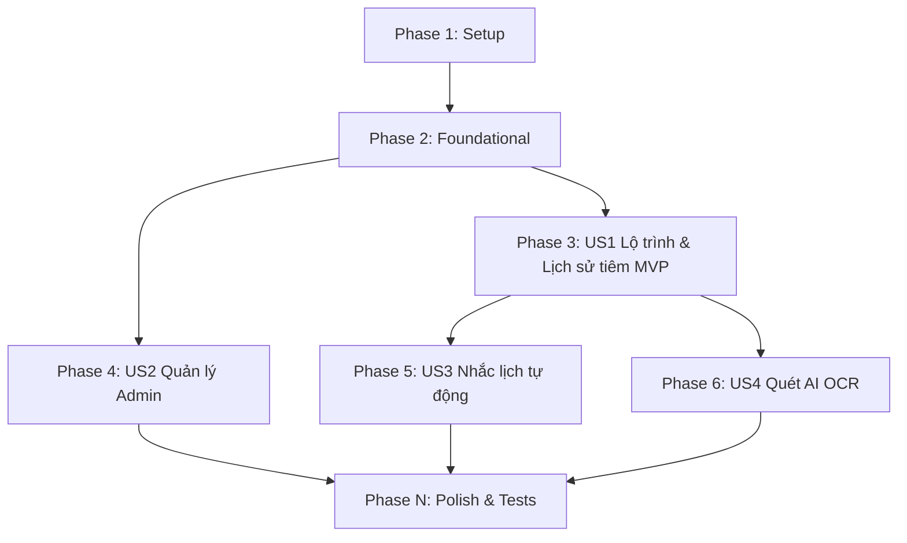

# Tasks: Baby Vaccination Tracker

**Input**: Design documents from `documents/baby-service-vaccination/`

**Prerequisites**: plan.md (required), spec.md (required for user stories), research.md, data-model.md, contracts/api.md

**Organization**: Các nhiệm vụ được nhóm theo User Story để phát triển và kiểm thử độc lập.

---

## Format: `[ID] [P?] [Story] Description`

- **[P]**: Có thể chạy song song (các file khác nhau, không phụ thuộc nhau)
- **[Story]**: Nhiệm vụ thuộc User Story nào (US1, US2, US3, US4)
- Các mô tả nhiệm vụ bắt buộc phải chứa đường dẫn file chính xác.

---

## Phase 1: Setup (Shared Infrastructure)

**Purpose**: Khởi tạo cấu hình và chuẩn bị ban đầu cho dự án.

- [x] T001 Khởi tạo cấu hình Kafka topic `vaccination-reminder-topic` trong file cấu hình local của Kafka Connect và Docker Compose tại `codebase/infrastructure/docker-compose.yml`
- [x] T002 Cấu hình cache Redis cho danh mục vắc-xin tại `codebase/backend/baby-service/src/main/resources/application.yml`

---

## Phase 2: Foundational (Blocking Prerequisites)

**Purpose**: Xây dựng nền tảng cơ sở dữ liệu và khai báo quyền hạn API. Đây là giai đoạn bắt buộc phải hoàn thành trước khi triển khai các User Story.

- [x] T003 Viết mã SQL Flyway migration tạo các bảng `vaccines`, `vaccine_schedule_configs` và cập nhật bảng `vaccinations` tại `codebase/backend/baby-service/src/main/resources/db/migration/V8__create_vaccination_schema.sql`
- [x] T004 Viết mã SQL Flyway migration bổ sung quyền API Admin và User tại `codebase/backend/authentication-service/src/main/resources/db/migration/V54__baby_vaccination_permissions.sql`

**Checkpoint**: Nền tảng database và quyền hạn đã sẵn sàng. Có thể bắt đầu triển khai các User Story độc lập.

---

## Phase 3: User Story 1 - Lộ trình & Lịch sử tiêm (Priority: P1) 🎯 MVP

**Goal**: Cho phép cha mẹ theo dõi lộ trình tiêm chủng khuyến nghị của con và đánh dấu hoàn thành mũi tiêm.

**Independent Test**: Đăng nhập tài khoản User, truy cập hồ sơ bé, xem lộ trình hiển thị đúng độ tuổi, bấm hoàn tất mũi 1 và kiểm tra xem mũi 2 có tự động dời lịch hay không.

### Implementation for User Story 1

- [x] T005 [P] [US1] Định nghĩa `VaccineEntity.java` trong `codebase/backend/baby-service/src/main/java/com/mom/baby/domain/VaccineEntity.java`
- [x] T006 [P] [US1] Định nghĩa `VaccineScheduleConfigEntity.java` trong `codebase/backend/baby-service/src/main/java/com/mom/baby/domain/VaccineScheduleConfigEntity.java`
- [x] T007 [US1] Cập nhật các trường mới trong `VaccinationEntity.java` tại `codebase/backend/baby-service/src/main/java/com/mom/baby/domain/VaccinationEntity.java`
- [x] T008 [P] [US1] Tạo repository `VaccineRepository.java` tại `codebase/backend/baby-service/src/main/java/com/mom/baby/repository/VaccineRepository.java`
- [x] T009 [P] [US1] Tạo repository `VaccineScheduleConfigRepository.java` tại `codebase/backend/baby-service/src/main/java/com/mom/baby/repository/VaccineScheduleConfigRepository.java`
- [x] T010 [US1] Cập nhật logic tự động tính lịch dự kiến khi bé chào đời trong `BabyService.java` tại `codebase/backend/baby-service/src/main/java/com/mom/baby/service/BabyService.java`
- [x] T011 [US1] Triển khai API lấy danh sách lộ trình tiêm và hoàn thành mũi tiêm trong `BabyController.java` tại `codebase/backend/baby-service/src/main/java/com/mom/baby/controller/BabyController.java` (tích hợp `DataIsolationUtil` để cô lập dữ liệu theo Family ID)
- [x] T012 [P] [US1] Thiết lập giao diện Bento Layout theo dõi lộ trình tiêm tại `codebase/frontend/src/app/baby/baby.component.html` và file CSS tương ứng
- [x] T013 [P] [US1] Định nghĩa logic gọi API và hiển thị ở Frontend tại `codebase/frontend/src/app/baby/baby.component.ts`
- [x] T014 [US1] Thêm các bản ghi dịch đa ngôn ngữ i18n tại `codebase/frontend/public/i18n/momApp/baby/` (vi.json, en.json, zh.json, ja.json) và chạy script compile-i18n.js

**Checkpoint**: User Story 1 hoạt động độc lập và đạt chuẩn MVP.

---

## Phase 4: User Story 2 - Quản lý Vắc-xin của Admin (Priority: P1)

**Goal**: Cho phép Admin hệ thống quản lý danh mục vắc-xin và các cấu hình lộ trình.

**Independent Test**: Đăng nhập tài khoản Admin, truy cập Admin Portal, tạo mới một loại vắc-xin và mũi tiêm mẫu, kiểm tra xem loại vắc-xin đó có hiển thị trong danh mục của hệ thống.

### Implementation for User Story 2

- [x] T015 [P] [US2] Triển khai nghiệp vụ CRUD vắc-xin và lộ trình trong `VaccineService.java` tại `codebase/backend/baby-service/src/main/java/com/mom/baby/service/VaccineService.java`
- [x] T016 [US2] Triển khai các REST endpoints Admin trong `VaccineController.java` tại `codebase/backend/baby-service/src/main/java/com/mom/baby/controller/VaccineController.java` (gán `@PreAuthorize` kiểm tra quyền `ROLE_ADMIN`)
- [x] T017 [US2] Xây dựng UI quản trị danh mục vắc-xin dành cho Admin tại `codebase/frontend/src/app/admin/vaccines/admin-vaccines.component.html` và TS file
- [x] T018 [US2] Tích hợp i18n 4 ngôn ngữ cho giao diện quản trị Admin tại `codebase/frontend/public/i18n/momApp/admin/vaccines/`

**Checkpoint**: Admin Portal quản lý tiêm chủng hoàn thành.

---

## Phase 5: User Story 3 - Nhắc lịch tiêm tự động (Priority: P2)

**Goal**: Hệ thống tự động gửi thông báo qua Web Push & Email nhắc lịch trước 3 ngày.

**Independent Test**: Thay đổi ngày dự kiến của một mũi tiêm thành `today + 3`, kích hoạt Scheduler quét và kiểm tra xem có nhận được Web Push và Email hay không.

### Implementation for User Story 3

- [x] T019 [US3] Viết Scheduler quét DB lúc 07:00 sáng hằng ngày trong `VaccinationScheduler.java` tại `codebase/backend/baby-service/src/main/java/com/mom/baby/service/VaccinationScheduler.java`
- [x] T020 [US3] Triển khai Kafka Producer gửi event nhắc lịch tới topic `vaccination-reminder-topic` trong `VaccinationEventPublisher.java` tại `codebase/backend/baby-service/src/main/java/com/mom/baby/event/VaccinationEventPublisher.java`
- [x] T021 [US3] Triển khai Kafka Consumer tiêu thụ sự kiện nhắc lịch trong `NotificationEventListener.java` tại `codebase/backend/notification-service/src/main/java/com/mom/notification/event/NotificationEventListener.java`
- [x] T022 [US3] Viết Unit Test kiểm tra logic gửi Kafka Event đúng cấu trúc payload tại `codebase/backend/baby-service/src/test/java/com/mom/baby/event/VaccinationEventPublisherTest.java`

**Checkpoint**: Nhắc lịch tự động tích hợp Kafka hoạt động trơn tru.

---

## Phase 6: User Story 4 - Quét sổ tiêm chủng bằng AI OCR (Priority: P3)

**Goal**: Cho phép chụp ảnh sổ tiêm giấy, sử dụng AI OCR để tự động phân tích và điền nhanh lịch sử tiêm.

**Independent Test**: Tải lên ảnh chụp sổ tiêm chủng mẫu, xem màn hình Preview hiển thị đúng tên vắc-xin và ngày tiêm, sửa đổi nếu cần và bấm lưu thành công.

### Implementation for User Story 4

- [x] T023 [US4] Tạo endpoint scan nhận tệp ảnh và gọi AI Service trong `BabyController.java` tại `codebase/backend/baby-service/src/main/java/com/mom/baby/controller/BabyController.java`
- [x] T024 [US4] Tích hợp client gọi API Gemini OCR tại `codebase/backend/ai-service/src/main/java/com/mom/ai/client/GeminiClient.java` và `FamilyCopilotService.java`
- [x] T025 [US4] Viết logic so khớp vắc-xin tự động và import vào DB cho bé trong `VaccinationOcrService.java` tại `codebase/backend/baby-service/src/main/java/com/mom/baby/service/VaccinationOcrService.java`
- [x] T026 [US4] Xây dựng nút bấm "Quét ảnh sổ tiêm" ở Frontend tại `codebase/frontend/src/app/baby/baby.component.html` và tích hợp cơ chế fallback thủ công tại `baby.component.ts`

**Checkpoint**: Hoàn tất tính năng quét AI OCR và cơ chế fallback thủ công.

---

## Phase N: Polish & Cross-Cutting Concerns

**Purpose**: Hoàn thiện tài liệu, kiểm thử tích hợp toàn bộ hệ thống và chuẩn hóa.

- [x] T027 Viết Integration Test cho quy trình tính toán dời ngày và cô lập Family ID tại `codebase/backend/baby-service/src/test/java/com/mom/baby/service/BabyVaccinationIntegrationTest.java`
- [x] T028 [P] Cập nhật hướng dẫn vận hành hệ thống tại `documents/babysystem-run-operation-guide.md`
- [x] T029 Chạy kịch bản xác minh để đảm bảo các Unit & Integration Tests hoạt động thành công hoàn hảo.

---

## Dependencies & Execution Order

### Quy định thực hiện song song (Parallel execution)
- Trong Phase 3 (US1): Triển khai Entity (`T005`, `T006`) và Repositories (`T008`, `T009`) song song với thiết kế Frontend UI (`T012`).
- Một khi Phase 2 (Foundational) hoàn tất, nhóm phát triển có thể chia việc:
  - Developer A: Hoàn thiện Phase 3 (US1 - MVP).
  - Developer B: Hoàn thiện Phase 4 (US2 - Admin Portal).

---

## Implementation Strategy

### MVP First (Tập trung hoàn tất US1)
1. Chạy migration tạo schema database (`T003`) và cấp quyền (`T004`).
2. Triển khai backend lưu trữ thực thể, CRUD và API complete mũi tiêm (`T005` -> `T011`).
3. Dựng UI Bento Layout và RxJS stream để Bố/Mẹ theo dõi, cập nhật lịch tiêm (`T012` -> `T014`).
4. **Dừng lại kiểm thử**: Chạy kịch bản 3 trong `quickstart.md` để chắc chắn MVP hoạt động độc lập tốt trước khi chuyển sang các tính năng khác.
