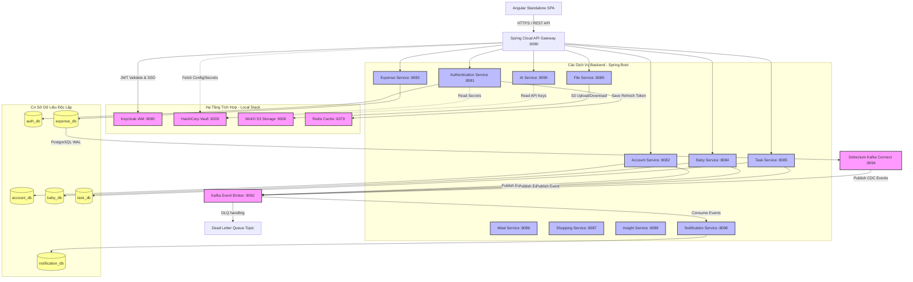
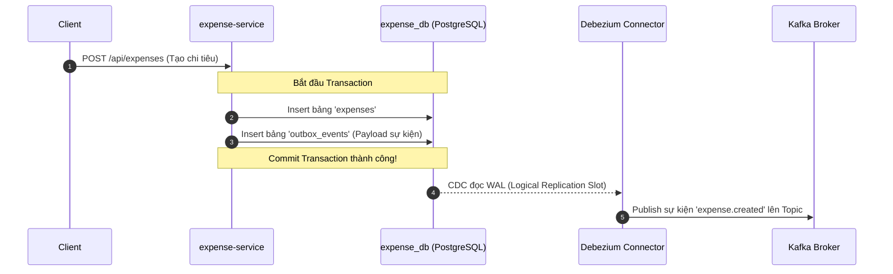
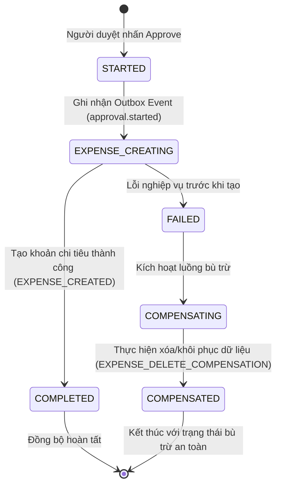

# BabySystem (Mom Super App) – Enterprise Microservices Full-Series Architecture

> **Tài Liệu Kiến Trúc Hệ Thống Chuẩn Doanh Nghiệp**  
> **Phiên bản:** 2.5.0 (Production-ready)  
> **Mục tiêu:** Tài liệu hóa các đặc tính kiến trúc cao cấp của BabySystem, chứng minh tính đồng bộ và chất lượng tương đương với các dự án thực tế lớn (Microservices Full-Series).

---

## 1. Giới thiệu Tổng quan

**BabySystem** (Mom Super App) là một siêu ứng dụng quản lý gia đình hiện đại, được thiết kế và phát triển theo kiến trúc **Microservices** phân tán hoàn chỉnh. Hệ thống cung cấp các giải pháp quản lý thông tin em bé, theo dõi dinh dưỡng, lập kế hoạch công việc, ghi chép chi tiêu, danh sách mua sắm và phân tích dữ liệu gia đình.

Hệ thống được xây dựng với mục tiêu đạt chuẩn doanh nghiệp (Enterprise-grade), tích hợp hàng loạt các **Advanced Architectural Patterns** thời thượng tương tự như các series microservices lớn nhất hiện nay.

---

## 2. Bản đồ Kiến trúc Hệ thống (System Architecture)

Dưới đây là sơ đồ luồng dữ liệu, các thành phần hạ tầng và cơ chế giao tiếp giữa các dịch vụ trong BabySystem:



---

## 3. Các Design Patterns Nâng Cao (Giống Hệ Thống Cấp Doanh Nghiệp)

Điểm làm nên sự khác biệt và đẳng cấp của BabySystem chính là việc áp dụng các giải pháp kỹ thuật phức tạp để giải quyết các bài toán kinh đoán trong hệ thống phân tán:

### 3.1. Transactional Outbox Pattern & Debezium CDC

Khi một nghiệp vụ thành công cần phát đi sự kiện (ví dụ: tạo chi tiêu mới -> gửi thông báo), việc viết trực tiếp vào DB nghiệp vụ và gửi tin nhắn lên Kafka cùng lúc (Dual-Write) rất dễ gây mất nhất quán nếu một trong hai bước lỗi.

*   **Giải pháp:** Áp dụng **Transactional Outbox Pattern**.
*   **Cách hoạt động:** `expense-service` lưu thông tin nghiệp vụ và bản ghi sự kiện vào bảng `outbox_events` trong cùng một transaction cơ sở dữ liệu.
*   **Debezium CDC (Change Data Capture):** Sử dụng Debezium quét nhật ký tuần tự (Write-Ahead Log - WAL) của PostgreSQL, tự động phát hiện bản ghi mới trong bảng `outbox_events` và stream trực tiếp lên Kafka một cách không đồng bộ và không gây chặn hệ thống.



### 3.2. Choreography-based Saga Pattern

Quản lý các giao dịch phân tán (Distributed Transactions) trên nhiều microservices mà không dùng cơ chế chặn (Two-Phase Commit) nhằm tăng tối đa hiệu năng.

*   **Nghiệp vụ áp dụng:** **Duyệt Đề xuất Chi tiêu (Expense Proposal Approval)**.
*   **Cơ chế:** Khi đề xuất chi tiêu được phê duyệt (`approved`), hệ thống cần tạo bản ghi chi phí thực tế ở một bảng/service khác và đồng bộ trạng thái. Nếu bước tạo chi phí thực tế lỗi, hệ thống phải thực hiện **Giao dịch Bù trừ (Compensating Transaction)** để hoàn tác/xóa đề xuất và khôi phục trạng thái ban đầu, tránh sai lệch tài chính.



### 3.3. Identity & Access Management (IAM) với Keycloak Single Sign-On

Thay vì tự xây dựng cơ chế quản lý User và phiên đăng nhập phức tạp, BabySystem tích hợp **Keycloak** – giải pháp IAM mã nguồn mở hàng đầu thế giới của Red Hat.

*   **OAuth2 / OIDC:** Đảm bảo luồng xác thực chuẩn hóa với cơ chế cấp phát Access Token (JWT) ngắn hạn và Refresh Token dài hạn.
*   **Phân quyền tinh tế (RBAC):** Định cấu hình vai trò (Admin, User, Family Owner) trực tiếp trên Keycloak Realm, tự động ánh xạ vào JWT Claims để các Microservices kiểm tra quyền hạn ở mức API.
*   **Single Sign-On (SSO):** Đăng nhập một lần tại cổng xác thực tập trung và truy cập an toàn toàn bộ hệ sinh thái của ứng dụng.

### 3.4. Centralized Secret Management với HashiCorp Vault

Bảo mật tuyệt đối thông tin nhạy cảm của hệ thống (Database Credentials, JWT Secret Keys, API Keys của các dịch vụ AI...).

*   **Không lưu cứng Secret (No Hardcoded Credentials):** Toàn bộ các mật mã nghiệp vụ được cất giữ an toàn trong **HashiCorp Vault**.
*   **Bootstrap Secrets:** Khi hệ thống khởi chạy, các Microservices sử dụng Token định danh để truy vấn trực tiếp secrets từ Vault qua kết nối bảo mật HTTPS, nạp trực tiếp vào bộ nhớ RAM của Spring Boot.

### 3.5. Sự kiện kiên định (Idempotent Consumer) & DLQ (Dead Letter Queue)

Đối với các consumer sự kiện (như `notification-service`), việc nhận tin nhắn trùng lặp từ Kafka (do network chập chờn hoặc retry) là điều hoàn toàn có thể xảy ra.

*   **Idempotency:** Mỗi khi xử lý sự kiện, consumer kiểm tra bảng `processed_events`. Nếu `event_id` đã tồn tại, tin nhắn sẽ bị bỏ qua một cách an toàn để không tạo thông báo lặp lại cho người dùng.
*   **Dead Letter Queue (DLQ):** Khi consumer gặp lỗi không thể phục hồi (ví dụ: lỗi dữ liệu tin nhắn sai định dạng), Spring Kafka sẽ tự động retry 3 lần (cách nhau 1 giây). Nếu vẫn lỗi, tin nhắn sẽ tự động chuyển sang Topic `.dlq` tương ứng để các kỹ sư hệ thống phân tích và replay lại sau, tránh nghẽn luồng xử lý chính.

---

## 4. Chi tiết các Microservices của Hệ thống

Hệ thống sở hữu **13 cấu trúc module dịch vụ** được tổ chức sạch sẽ, độc lập, tối ưu cao:

| # | Service Name | Công nghệ chính | Chức năng chi tiết | Database | Cổng chạy |
| :--- | :--- | :--- | :--- | :--- | :--- |
| 1 | **api-gateway** | Spring Cloud Gateway | Điểm kết nối duy nhất, định tuyến request, xác thực JWT tập trung, bảo vệ hệ thống bên trong. | *Không có DB* | `8080` |
| 2 | **authentication-service** | Spring Boot, Redis, Keycloak | Cấp phát token, quản lý phiên đăng nhập, phân quyền, cấu hình 2FA OTP và kiểm tra độ mạnh mật khẩu. | `auth_db` | `8081` |
| 3 | **account-service** | Spring Boot | Quản lý thông tin tài khoản, hồ sơ cá nhân và kết nối cấu trúc gia đình (Family Unit). | `account_db` | `8082` |
| 4 | **baby-service** | Spring Boot, Kafka | Quản lý thông tin chi tiết của em bé (ngày sinh, chỉ số sức khỏe, nhật ký hoạt động). | `baby_db` | `8084` |
| 5 | **task-service** | Spring Boot, Kafka | Quản lý danh sách công việc gia đình, nhắc nhở thời hạn công việc (Task Overdue). | `task_db` | `8085` |
| 6 | **meal-service** | Spring Boot | Lên kế hoạch dinh dưỡng, theo dõi bữa ăn của bé và cả gia đình. | `meal_db` | `8086` |
| 7 | **expense-service** | Spring Boot, Kafka, Outbox | Quản lý chi thu tài chính gia đình, xử lý Saga duyệt đề xuất chi tiêu phức tạp. | `expense_db` | `8083` |
| 8 | **shopping-service** | Spring Boot | Quản lý danh mục hàng hóa cần mua sắm và chia sẻ danh sách giữa các thành viên. | `shopping_db` | `8087` |
| 9 | **insight-service** | Spring Boot | Tổng hợp dữ liệu từ các dịch vụ khác, trực quan hóa biểu đồ tài chính, dinh dưỡng và tăng trưởng. | `insight_db` | `8088` |
| 10 | **file-service** | Spring Boot, MinIO S3 | Quản lý upload/download tài liệu, hóa đơn, giấy tờ, tích hợp viewer PDF/Ảnh bảo mật. | `file_db` | `8089` |
| 11 | **ai-service** | Spring Boot, OpenAi/Gemini API | Cung cấp các gợi ý chăm sóc bé thông minh dựa trên AI, phân tích hành vi tăng trưởng. | *Không có DB* | `8090` |
| 12 | **notification-service** | Spring Boot, Kafka, DLQ | Nhận các event sự kiện từ Kafka để gửi thông báo thời gian thực đến người dùng. | `notification_db` | `8098` |
| 13 | **common-lib** | Java | Thư viện đóng gói các DTO dùng chung, định dạng `ApiResponse<T>`, custom exceptions và event topics constants. | *Không có DB* | *Thư viện* |

---

## 5. Kiến Trúc Frontend (Angular Standalone SPA)

Không chỉ mạnh mẽ ở Backend, Frontend của BabySystem cũng được đầu tư thiết kế vượt bậc với các tiêu chuẩn UI/UX cao cấp nhất:

*   **Standalone Components:** Loại bỏ hoàn toàn sự rườm rà của NgModules truyền thống, tăng tốc thời gian build và tính cô lập của component.
*   **Premium Aesthetics (Glassmorphism & Bento Grid):** Giao diện sử dụng hiệu ứng chiều sâu, lớp kính mờ sang trọng (`backdrop-filter`), bố cục Bento Grid tối ưu không gian, kết hợp cùng các micro-animations tinh tế mang lại cảm giác sống động (Alive UI).
*   **Reactive State Management:** Tận dụng tối đa sức mạnh của **RxJS** (BehaviorSubject, switchMap) để tạo ra các luồng dữ liệu phản ứng tức thì không cần reload.
*   **Đa ngôn ngữ (i18n):** Tích hợp sâu thư viện `ngx-translate`, cho phép chuyển đổi mượt mà giữa Tiếng Việt và Tiếng Anh lập tức tại runtime.

---

## 6. Hướng dẫn Khởi chạy Nhanh (Quick Start Guide)

Hệ thống đã được đóng gói tối đa để có thể chạy cực kỳ dễ dàng dưới môi trường local:

### Bước 1: Khởi động Hạ tầng (Docker Local Stack)
Di chuyển vào thư mục hạ tầng và khởi động toàn bộ dịch vụ phụ trợ:
```bash
cd codebase/infrastructure
docker compose up -d
```
*Các dịch vụ sẽ chạy nền bao gồm: PostgreSQL, Redis, Kafka, Zookeeper, Kafka UI, Debezium Connect, Vault, Keycloak, MinIO.*

### Bước 2: Thiết lập cấu hình Bảo mật (Vault & Keycloak)
*   **Khởi tạo secrets trong Vault:**
    *   Với Linux/macOS: `sh vault/bootstrap-secrets.sh`
    *   Với Windows (PowerShell): `.\vault\bootstrap-secrets.ps1`
*   **Keycloak mặc định:**
    *   Cổng quản trị: `http://localhost:8080/admin` (Tài khoản: `admin` / `admin`)
    *   Realm đã import sẵn: `micro-services` với client `frontend-app`.
    *   Tài khoản test demo: `demo.user` / `demo123`

### Bước 3: Build và chạy các Backend Services
Build thư viện dùng chung trước:
```bash
cd codebase/backend/common-lib
mvn clean install
```
Sau đó chạy dịch vụ bạn muốn phát triển (ví dụ: `expense-service`):
```bash
cd ../expense-service
./mvnw spring-boot:run
```

### Bước 4: Khởi chạy Frontend Angular
```bash
cd codebase/frontend
npm install
npm start
```
*Giao diện ứng dụng sẽ sẵn sàng tại: `http://localhost:4200`*

---

## 7. Bảng Đối Chiếu Tính Năng Hệ Thống (Wow Factor Matrix)

| Đặc trưng thiết kế | Microservices nghiệp dư (Simple MVP) | BabySystem (Enterprise Full-Series) |
| :--- | :--- | :--- |
| **Giao tiếp liên dịch vụ** | Gọi HTTP REST đồng bộ, dễ gây lỗi dây chuyền (Cascade Failure). | **Event-Driven hoàn toàn qua Kafka**, giảm thiểu tối đa coupling. |
| **Tính toàn vẹn dữ liệu** | Ghi DB nghiệp vụ và gọi gửi message thủ công (Dễ mất event). | **Transactional Outbox kết hợp Debezium CDC** đọc WAL của PostgreSQL. |
| **Giao dịch phân tán** | Không xử lý, gây sai lệch dữ liệu tài chính khi lỗi. | **Choreography Saga Pattern** kèm giao dịch bù trừ (Compensating) tự động. |
| **Bảo mật mật mã** | Lưu trực tiếp mật mã, DB connection trong file `application.yml`. | **HashiCorp Vault tập trung**, giải mã tại RAM lúc runtime. |
| **Quản trị người dùng** | Tự code bảng User, quản lý session thủ công. | **Keycloak Identity Server chuyên nghiệp** hỗ trợ SSO, OIDC, 2FA OTP. |
| **Xử lý tin nhắn lỗi** | Bỏ qua tin nhắn lỗi hoặc làm crash consumer. | **Kafka Retry 3 lần & Dead Letter Queue (DLQ)** cho mọi topic sự kiện. |
| **Giao diện người dùng** | Plain HTML, CSS đơn giản, dùng UI mặc định của browser. | **Premium Glassmorphism, Bento Grid**, micro-animations mượt mà, i18n real-time. |

---

> **Lưu ý:** Mọi tài liệu chi tiết của từng Service nghiệp vụ, cấu hình CI/CD Jenkinsfile, hay cấu trúc cơ sở dữ liệu chi tiết đều có thể được tìm thấy trong thư mục [documents](file:///d:/AI-AGENT/BabySystem/documents/). Hãy truy cập để tiếp tục khám phá mã nguồn tuyệt vời của BabySystem!
