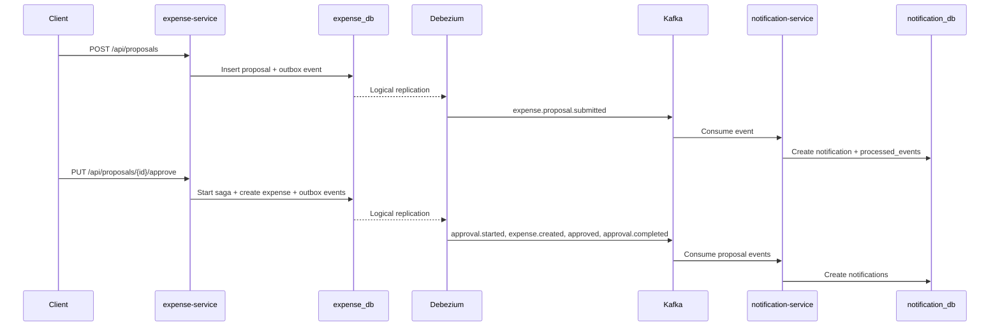

# Expense Proposal Outbox Saga - Hướng Dẫn Chạy Và Vận Hành

Tài liệu này mô tả cách chạy, kiểm tra và vận hành luồng Kafka Outbox + Debezium + Saga cho chức năng duyệt đề xuất chi tiêu trong BabySystem.

## Mục Tiêu

Luồng này xử lý việc tạo và duyệt đề xuất chi tiêu theo hướng event-driven:

- `expense-service` ghi dữ liệu nghiệp vụ và outbox trong cùng transaction.
- Debezium đọc bảng `expense_db.public.outbox_events` bằng PostgreSQL logical replication.
- Debezium route event sang Kafka topic tương ứng.
- `notification-service` consume các topic `expense.proposal.*` và tạo notification.
- Nếu consumer lỗi, Spring Kafka retry rồi đẩy message sang topic `.dlq`.

## Thành Phần

| Thành phần | Vai trò | Local endpoint |
| --- | --- | --- |
| PostgreSQL | Lưu database, bật logical replication cho Debezium | `localhost:5432` |
| Kafka | Message broker | `localhost:9092` |
| Kafka UI | Xem topic/message | `http://localhost:8085` |
| Debezium Connect | Đọc outbox từ Postgres và publish Kafka | `http://localhost:8094` |
| expense-service | Tạo proposal, chạy saga approval, ghi outbox | `http://localhost:8083` |
| notification-service | Consume event, tạo notification, xử lý DLQ | `http://localhost:8098` |

## File Quan Trọng

| File | Mục đích |
| --- | --- |
| `codebase/infrastructure/docker-compose.yml` | Khởi chạy Postgres, Kafka, Kafka UI, Debezium Connect |
| `codebase/infrastructure/kafka/create-topics.sh` | Tạo Kafka topic và DLQ topic |
| `codebase/infrastructure/debezium/expense-outbox-connector.json` | Cấu hình Debezium connector |
| `codebase/backend/expense-service/src/main/resources/db/migration/V4__create_outbox_events_table.sql` | Tạo bảng outbox |
| `codebase/backend/expense-service/src/main/resources/db/migration/V5__create_expense_proposal_sagas_table.sql` | Tạo bảng saga |
| `codebase/backend/notification-service/src/main/resources/db/migration/V2__create_processed_events_table.sql` | Lưu event đã xử lý để idempotent |
| `codebase/backend/notification-service/src/main/java/com/mom/notification/config/KafkaDlqConfig.java` | Retry và DLQ cho Kafka consumer |

## Luồng Chạy



## Kafka Topics

Business topics:

- `expense.created`
- `expense.updated`
- `expense.deleted`
- `expense.proposal.submitted`
- `expense.proposal.approved`
- `expense.proposal.rejected`
- `expense.proposal.resubmitted`
- `expense.proposal.approval.started`
- `expense.proposal.approval.completed`
- `expense.proposal.approval.failed`
- `expense.proposal.approval.compensated`

DLQ topics:

- `notification.requested.dlq`
- `expense.proposal.submitted.dlq`
- `expense.proposal.approved.dlq`
- `expense.proposal.rejected.dlq`
- `expense.proposal.resubmitted.dlq`
- `expense.proposal.approval.started.dlq`
- `expense.proposal.approval.completed.dlq`
- `expense.proposal.approval.failed.dlq`
- `expense.proposal.approval.compensated.dlq`

## Cách Chạy Local

### 1. Khởi chạy infrastructure

Chạy từ thư mục `D:\AI-AGENT\BabySystem\codebase\infrastructure`:

```powershell
docker compose up -d postgres redis zookeeper kafka kafka-init kafka-ui debezium-connect debezium-init vault
```

Kiểm tra container:

```powershell
docker ps --format "table {{.Names}}\t{{.Status}}\t{{.Ports}}"
```

Các container tối thiểu cần chạy:

- `mom-postgres`
- `mom-kafka`
- `mom-zookeeper`
- `mom-kafka-ui`
- `mom-debezium-connect`
- `mom-vault`

### 2. Kiểm tra Postgres logical replication

```powershell
docker exec mom-postgres psql -U postgres -d expense_db -tAc "show wal_level;"
```

Kết quả đúng:

```text
logical
```

Nếu kết quả là `replica`, recreate Postgres container để nhận cấu hình mới:

```powershell
docker compose up -d --force-recreate postgres
```

### 3. Tạo Kafka topics

Thông thường `kafka-init` tự tạo topic. Nếu cần chạy lại:

```powershell
docker compose up -d --force-recreate kafka-init
docker logs mom-kafka-init
```

Kiểm tra topic:

```powershell
docker exec mom-kafka kafka-topics --bootstrap-server localhost:9092 --list
```

### 4. Đăng ký Debezium connector

Nếu `debezium-init` chưa đăng ký được connector, đăng ký thủ công từ thư mục `D:\AI-AGENT\BabySystem`:

```powershell
Invoke-RestMethod `
  -Method Put `
  -Uri http://localhost:8094/connectors/expense-outbox-connector/config `
  -ContentType "application/json" `
  -InFile .\codebase\infrastructure\debezium\expense-outbox-connector.json
```

Kiểm tra connector:

```powershell
Invoke-RestMethod -Uri http://localhost:8094/connectors/expense-outbox-connector/status |
  ConvertTo-Json -Depth 10
```

Kết quả đúng là connector và task đều `RUNNING`:

```json
{
  "name": "expense-outbox-connector",
  "connector": {
    "state": "RUNNING"
  },
  "tasks": [
    {
      "id": 0,
      "state": "RUNNING"
    }
  ]
}
```

### 5. Build service

Build `common-lib` trước vì `expense-service` và `notification-service` dùng chung topic constant:

```powershell
.\mvnw.cmd clean install -DskipTests
```

Chạy lệnh trên trong các thư mục:

```text
D:\AI-AGENT\BabySystem\codebase\backend\common-lib
D:\AI-AGENT\BabySystem\codebase\backend\expense-service
D:\AI-AGENT\BabySystem\codebase\backend\notification-service
```

### 6. Chạy expense-service

Chạy từ thư mục `D:\AI-AGENT\BabySystem`:

```powershell
Start-Process java `
  -ArgumentList "-jar codebase\backend\expense-service\target\expense-service-0.0.1-SNAPSHOT.jar" `
  -RedirectStandardOutput "run-logs\expense-service.out.log" `
  -RedirectStandardError "run-logs\expense-service.err.log" `
  -WindowStyle Hidden
```

Kiểm tra port:

```powershell
Get-NetTCPConnection -LocalPort 8083 -State Listen
```

### 7. Chạy notification-service

```powershell
Start-Process java `
  -ArgumentList "-jar codebase\backend\notification-service\target\notification-service-0.0.1-SNAPSHOT.jar" `
  -RedirectStandardOutput "run-logs\notification-service.out.log" `
  -RedirectStandardError "run-logs\notification-service.err.log" `
  -WindowStyle Hidden
```

Kiểm tra port:

```powershell
Get-NetTCPConnection -LocalPort 8098 -State Listen
```

## Cách Test End-to-End

### 1. Tạo proposal

```powershell
$body = @{
  familyId = 1
  title = "Saga test $(Get-Date -Format yyyyMMddHHmmss)"
  amount = 100000
  categoryName = "Saga Test"
  proposedBy = "Mom"
  approver = "Dad"
} | ConvertTo-Json

$proposal = Invoke-RestMethod `
  -Method Post `
  -Uri http://localhost:8083/api/proposals `
  -ContentType "application/json" `
  -Body $body `
  -Headers @{ "X-User-Id"="1"; "X-Family-Ids"="1"; "X-User-Admin"="true" }

$proposal | ConvertTo-Json -Depth 10
```

Kết quả đúng: `data.status` là `PENDING`.

### 2. Approve proposal

```powershell
$id = $proposal.data.id

$approved = Invoke-RestMethod `
  -Method Put `
  -Uri "http://localhost:8083/api/proposals/$id/approve?approver=Dad" `
  -Headers @{ "X-User-Id"="1"; "X-Family-Ids"="1"; "X-User-Admin"="true" }

$approved | ConvertTo-Json -Depth 10
```

Kết quả đúng: `data.status` là `APPROVED`.

### 3. Kiểm tra saga table

```powershell
docker exec mom-postgres psql -U postgres -d expense_db -tAc `
  "select id,proposal_id,status,current_step,created_expense_id,error_message from expense_proposal_sagas order by created_at desc limit 5;"
```

Kết quả thành công sẽ có:

```text
COMPLETED|EXPENSE_CREATED|<expense_id>
```

### 4. Kiểm tra outbox

```powershell
docker exec mom-postgres psql -U postgres -d expense_db -tAc `
  "select aggregatetype,type,aggregateid from outbox_events order by timestamp desc limit 10;"
```

Với flow approve thành công, cần thấy các event:

- `expense.proposal.submitted`
- `expense.proposal.approval.started`
- `expense.created`
- `expense.proposal.approved`
- `expense.proposal.approval.completed`

### 5. Kiểm tra Kafka offset

```powershell
docker exec mom-kafka kafka-run-class kafka.tools.GetOffsetShell `
  --broker-list localhost:9092 `
  --topic expense.proposal.approval.completed
```

Offset lớn hơn `0` nghĩa là topic đã nhận message.

### 6. Kiểm tra notification

```powershell
docker exec mom-postgres psql -U postgres -d notification_db -tAc `
  "select type,title,message,status from notifications order by created_at desc limit 10;"
```

Kết quả đúng sẽ có các notification như:

- `Expense proposal submitted`
- `Expense approval started`
- `Expense proposal approved`
- `Expense approval completed`

Kiểm tra idempotency:

```powershell
docker exec mom-postgres psql -U postgres -d notification_db -tAc `
  "select event_type,event_id from processed_events order by processed_at desc limit 10;"
```

## Vận Hành Hằng Ngày

### Xem trạng thái service

```powershell
Get-NetTCPConnection -LocalPort 8083,8098 -State Listen |
  Select-Object LocalAddress,LocalPort,OwningProcess
```

Xem process:

```powershell
Get-Process -Id (Get-NetTCPConnection -LocalPort 8083,8098 -State Listen |
  Select-Object -ExpandProperty OwningProcess -Unique) |
  Select-Object Id,ProcessName,Path
```

### Xem log service

```powershell
Get-Content .\run-logs\expense-service.out.log -Tail 100
Get-Content .\run-logs\expense-service.err.log -Tail 100
Get-Content .\run-logs\notification-service.out.log -Tail 100
Get-Content .\run-logs\notification-service.err.log -Tail 100
```

### Dừng service

```powershell
$pids = Get-NetTCPConnection -LocalPort 8083,8098 -State Listen |
  Select-Object -ExpandProperty OwningProcess -Unique

Stop-Process -Id $pids -Force
```

Kiểm tra lại:

```powershell
Get-NetTCPConnection -LocalPort 8083,8098 -State Listen -ErrorAction SilentlyContinue
```

Nếu không có output nghĩa là port đã trống.

### Restart Debezium connector

```powershell
Invoke-RestMethod `
  -Method Post `
  -Uri http://localhost:8094/connectors/expense-outbox-connector/restart
```

Restart task:

```powershell
Invoke-RestMethod `
  -Method Post `
  -Uri http://localhost:8094/connectors/expense-outbox-connector/tasks/0/restart
```

### Xem connector config

```powershell
Invoke-RestMethod -Uri http://localhost:8094/connectors/expense-outbox-connector/config |
  ConvertTo-Json -Depth 10
```

### Xem Kafka message bằng console consumer

```powershell
docker exec mom-kafka kafka-console-consumer `
  --bootstrap-server localhost:9092 `
  --topic expense.proposal.approval.completed `
  --from-beginning `
  --max-messages 5 `
  --timeout-ms 5000
```

## Xử Lý Lỗi Và DLQ

`notification-service` dùng `DefaultErrorHandler`:

- Retry tối đa 3 lần.
- Mỗi lần cách nhau 1 giây.
- Nếu vẫn lỗi, message được publish sang `<topic>.dlq`.

Kiểm tra DLQ offset:

```powershell
docker exec mom-kafka kafka-run-class kafka.tools.GetOffsetShell `
  --broker-list localhost:9092 `
  --topic expense.proposal.approval.completed.dlq
```

Nếu offset lớn hơn `0`, đọc message lỗi:

```powershell
docker exec mom-kafka kafka-console-consumer `
  --bootstrap-server localhost:9092 `
  --topic expense.proposal.approval.completed.dlq `
  --from-beginning `
  --max-messages 10 `
  --timeout-ms 5000
```

Sau khi fix bug consumer, có thể replay thủ công bằng cách publish lại payload vào topic gốc. Cần kiểm tra bảng `processed_events` trước, vì event đã xử lý rồi sẽ bị bỏ qua để tránh tạo notification trùng.

## Saga State

Bảng `expense_proposal_sagas` lưu trạng thái saga approval.

| Status | Current step | Ý nghĩa |
| --- | --- | --- |
| `STARTED` | `APPROVAL_ACCEPTED` | Người duyệt đã approve, saga bắt đầu |
| `COMPLETED` | `EXPENSE_CREATED` | Đã tạo expense thật, flow thành công |
| `FAILED` | `EXPENSE_CREATE_FAILED` | Lỗi trước khi tạo expense |
| `COMPENSATED` | `EXPENSE_DELETE_COMPENSATION` | Đã tạo expense nhưng lỗi sau đó, hệ thống xóa expense để bù trừ |

Proposal chỉ chuyển sang `APPROVED` khi saga thành công. Nếu lỗi, proposal chuyển sang `APPROVAL_FAILED` và lưu lý do vào `reject_reason`.

## Troubleshooting

### Port 8083 hoặc 8098 bị chiếm

```powershell
Get-NetTCPConnection -LocalPort 8083,8098 -State Listen |
  Select-Object LocalPort,OwningProcess
```

Kill đúng process đang giữ port:

```powershell
Stop-Process -Id <PID> -Force
```

### Debezium connector task FAILED

Kiểm tra status:

```powershell
Invoke-RestMethod -Uri http://localhost:8094/connectors/expense-outbox-connector/status |
  ConvertTo-Json -Depth 10
```

Các nguyên nhân thường gặp:

- Postgres chưa bật `wal_level=logical`.
- Kafka chưa chạy.
- Connector config sai field outbox.
- Replication slot/publication bị conflict sau nhiều lần recreate.

Nếu cần reset connector local:

```powershell
Invoke-RestMethod `
  -Method Delete `
  -Uri http://localhost:8094/connectors/expense-outbox-connector

Invoke-RestMethod `
  -Method Put `
  -Uri http://localhost:8094/connectors/expense-outbox-connector/config `
  -ContentType "application/json" `
  -InFile .\codebase\infrastructure\debezium\expense-outbox-connector.json
```

### API chạy nhưng Kafka không có message

Kiểm tra theo thứ tự:

1. API có ghi outbox không:

```powershell
docker exec mom-postgres psql -U postgres -d expense_db -tAc `
  "select count(*) from outbox_events;"
```

2. Debezium connector có `RUNNING` không.

3. Topic có tồn tại không:

```powershell
docker exec mom-kafka kafka-topics --bootstrap-server localhost:9092 --list |
  Select-String "expense.proposal"
```

4. Offset topic có tăng không:

```powershell
docker exec mom-kafka kafka-run-class kafka.tools.GetOffsetShell `
  --broker-list localhost:9092 `
  --topic expense.proposal.submitted
```

### Notification không tạo record

Kiểm tra consumer group đã được assign topic chưa:

```powershell
Get-Content .\run-logs\notification-service.out.log -Tail 200 |
  Select-String "partitions assigned|expense.proposal|Dispatched"
```

Kiểm tra DLQ:

```powershell
docker exec mom-kafka kafka-run-class kafka.tools.GetOffsetShell `
  --broker-list localhost:9092 `
  --topic expense.proposal.submitted.dlq
```

Kiểm tra đã xử lý event chưa:

```powershell
docker exec mom-postgres psql -U postgres -d notification_db -tAc `
  "select event_type,event_id from processed_events order by processed_at desc limit 20;"
```

## Kết Quả Xác Minh Gần Nhất

Ngày xác minh: `2026-05-29`

Flow đã chạy thành công với proposal test:

- Proposal `id=6` tạo thành công ở trạng thái `PENDING`.
- Approve thành công, proposal chuyển sang `APPROVED`.
- Saga tạo record `COMPLETED / EXPENSE_CREATED`.
- Expense thật được tạo với `id=9054`.
- Outbox có đủ event lifecycle.
- Kafka topic `expense.proposal.approval.completed` có message.
- `notification-service` tạo notification từ các event proposal.
- Các DLQ topic kiểm tra có offset `0`, chưa có message lỗi.
