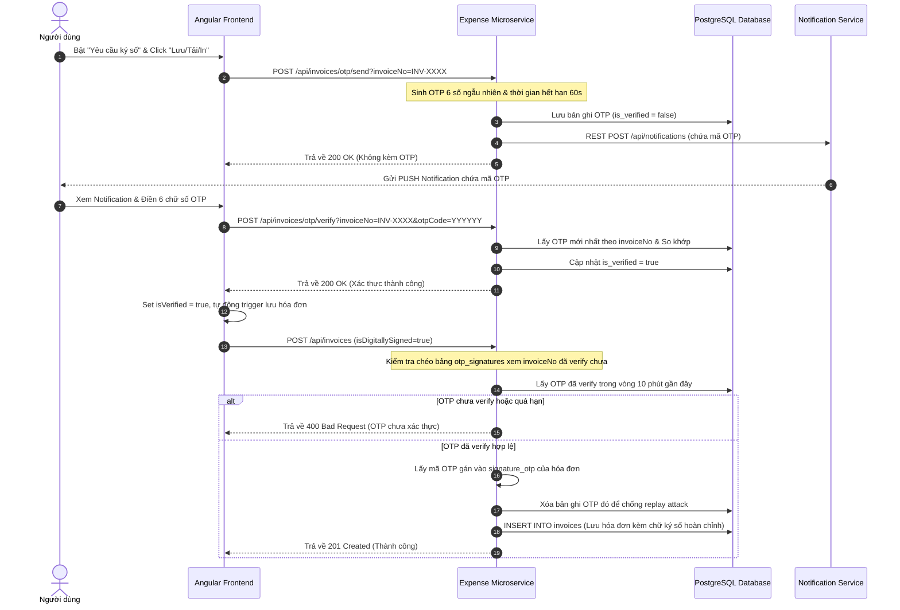

# Expense Service - Quy Trình Xác Thực Ký Số Điện Tử (2FA OTP) Hóa Đơn & Lưu DB Kiểm Chứng

Tài liệu này hướng dẫn chi tiết về cơ chế xác thực ký số điện tử (Digital Signature) bằng mã OTP thật trên phân hệ Quản lý Hóa đơn của `expense-service`, bao gồm giao diện cấu hình bật/tắt (tương tự như `authentication-service`) và cơ chế lưu trữ thông tin kiểm chứng (audit trail) trực tiếp vào Cơ sở dữ liệu.

---

## 1. Tổng Quan Quy Trình Ký Số & Lưu DB Kiểm Chứng (2FA DB-Backed OTP)

Để đảm bảo tính pháp lý, bảo mật cao và chống hoàn toàn việc bypass từ Client-side, hệ thống áp dụng cơ chế xác thực đa yếu tố (2FA) sử dụng Database để sinh, lưu trữ và xác thực mã OTP trước khi cho phép người dùng thực hiện thao tác: In, Tải PDF, và Lưu Hóa đơn.



---

## 2. Thiết Kế Cơ Sở Dữ Liệu & Audit Trail

### 2.1 Cấu Trúc Bảng invoices (Audit Trail)
Chúng ta sử dụng file migration SQL **`V7__add_invoice_digital_signature_fields.sql`** để mở rộng cấu trúc bảng `invoices`, phục vụ lưu trữ thông tin kiểm chứng ký số:
- **`authorized_signer`** (Người ký tên phát hành): Tên của chủ tài khoản thực hiện ký phát hành hóa đơn (ví dụ: *"Chủ hộ Family OS"* hoặc tên người dùng cụ thể nhập từ form).
- **`is_digitally_signed`** (Đã ký số điện tử): Cờ đánh dấu hóa đơn này đã được xác thực ký số qua OTP thật thành công (`true` hoặc `false`).
- **`signature_otp`** (Mã OTP xác thực): Lưu vết chính xác mã OTP 6 chữ số ngẫu nhiên thật đã được sinh ra và gửi cho người dùng để xác nhận thao tác ký số hóa đơn này.
- **`signed_at`** (Thời gian ký số): Ghi nhận chính xác ngày giờ người dùng xác nhận OTP thành công.

### 2.2 Cấu Trúc Bảng otp_signatures (OTP Tạm Thời)
Để quản lý và xác thực mã OTP an toàn ở phía Backend, chúng ta thiết lập bảng **`otp_signatures`** thông qua file migration **`V8__create_otp_signatures_table.sql`**:

```sql
CREATE TABLE IF NOT EXISTS otp_signatures (
    id BIGSERIAL PRIMARY KEY,
    user_id BIGINT NOT NULL,
    invoice_no VARCHAR(50) NOT NULL,
    otp_code VARCHAR(6) NOT NULL,
    expired_at TIMESTAMPTZ NOT NULL,
    is_verified BOOLEAN NOT NULL DEFAULT FALSE,
    created_at TIMESTAMPTZ NOT NULL DEFAULT NOW()
);
CREATE INDEX IF NOT EXISTS idx_otp_signatures_invoice_no ON otp_signatures(invoice_no);
```

Các trường thông tin bao gồm:
- **`user_id`**: ID của người dùng yêu cầu sinh mã OTP.
- **`invoice_no`**: Mã số hóa đơn điện tử liên kết.
- **`otp_code`**: Mã xác thực OTP 6 chữ số sinh ngẫu nhiên.
- **`expired_at`**: Thời điểm hết hạn của OTP (sau 60 giây).
- **`is_verified`**: Đánh dấu OTP đã được đối chiếu và xác thực thành công trong DB.

---

## 3. Chi Tiết Các Thành Phần Triển Khai (Frontend & Backend)

### 3.1 Cấu Hình Bật/Tắt OTP Ký Số (Security Switch Banner)
Giao diện được cấu hình ngay trên phần thông tin của hóa đơn (phía trên form nhập liệu) tương tự như trang thiết lập bảo mật của `authentication-service` (Profile):
- **Cờ trạng thái:** `requireOtpForSigning` (mặc định: `true`).
- **Giao diện:** Switch Ant Design (`nz-switch`) nằm trong banner bảo mật màu cam óng ánh, có logo khiên bảo vệ và chú thích trực quan.
- **Bypass OTP:** Khi tắt switch (`requireOtpForSigning = false`), hệ thống tự động gán `isVerified = true` cho phép người dùng In/Tải/Lưu ngay lập tức mà không cần qua Modal xác thực. Trạng thái lưu DB sẽ ghi nhận `is_digitally_signed = false`, `signature_otp = null`, `signed_at = null`.

### 3.2 Giao Diện Nhập OTP 6 Ô Độc Lập (Focus Leap & Paste)
Nâng cấp ô nhập liệu đơn thành 6 ô độc lập tương tự như authen service để gia tăng tính thẩm mỹ và trải nghiệm cao cấp:
- **Chế độ nhảy focus mượt mà (Focus Leap):** Nhập 1 số tự động nhảy focus sang ô kế tiếp. Nhấn phím `Backspace` tự động xóa và nhảy lùi focus về ô trước.
- **Hỗ trợ điều hướng:** Cho phép dùng phím mũi tên `Trái` / `Phải` để di chuyển nhanh giữa các ô.
- **Hỗ trợ Paste mã số (Clipboard Paste):** Copy mã OTP 6 số (ví dụ từ Notification) và paste vào ô đầu tiên, hệ thống sẽ tự động phân tách và điền đầy đủ cả 6 ô, sau đó tự động focus vào ô cuối cùng.
- **Chặn ký tự lạ:** Chỉ cho phép nhập số (`0-9`), chặn hoàn toàn các phím chữ cái hoặc ký tự đặc biệt khác.

### 3.3 Backend Mapping & DTOs (Java Backend)
- **`InvoiceEntity.java`:** Thêm các trường `@Column` tương ứng với schema DB: `authorizedSigner`, `isDigitallySigned`, `signatureOtp`, `signedAt`.
- **`CreateInvoiceRequest.java`:** Mở rộng record để nhận thêm 4 tham số chứng thực ký số từ Frontend.
- **`InvoiceResponse.java`:** Trả về đầy đủ các thông tin ký số kèm method mapping static `fromEntity()` để phục vụ hiển thị lịch sử hoặc hậu kiểm.
- **`InvoiceServiceImpl.java`:** Thực hiện gán (set) các trường chứng thực từ request DTO sang entity và lưu trữ an toàn xuống cơ sở dữ liệu qua `InvoiceRepository.save()`.

---

## 4. Hướng Dẫn Kiểm Thử & Kiểm Chứng (Auditing Test)

1.  **Thực hiện Ký số:** Bật Switch OTP 2FA lên, điền hóa đơn, nhấn **Lưu vào Tài liệu**.
2.  **Nhập OTP thành công:** Nhập đúng mã OTP sinh ra gửi qua Notification (hoặc badge demo) -> Hóa đơn được ký số và lưu DB thành công.
3.  **Kiểm chứng DB:**
    *   Truy cập cơ sở dữ liệu và thực hiện truy vấn bảng `invoices`:
        ```sql
        SELECT invoice_no, authorized_signer, is_digitally_signed, signature_otp, signed_at 
        FROM invoices 
        ORDER BY created_at DESC LIMIT 1;
        ```
    *   **Kết quả mong đợi:**
        *   `is_digitally_signed` có giá trị `true`.
        *   `signature_otp` hiển thị chính xác mã 6 chữ số ngẫu nhiên thật vừa nhập.
        *   `authorized_signer` ghi nhận tên người ký.
        *   `signed_at` ghi nhận thời gian ký số chính xác.
4.  **Kiểm chứng khi tắt bảo mật:** Tắt Switch OTP 2FA, lưu hóa đơn trực tiếp, sau đó truy vấn DB:
    *   `is_digitally_signed` có giá trị `false`.
    *   `signature_otp` và `signed_at` có giá trị `null` (do không thực hiện ký số OTP).
