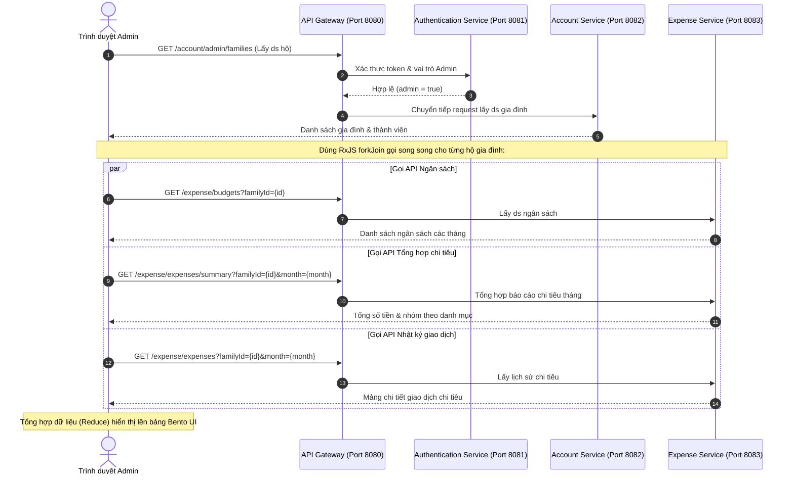

# Tài liệu Thiết kế Hệ thống: Phân hệ Quản trị Tài chính Gia đình (Admin Finance Workspace)

Tài liệu này đặc tả kiến trúc kỹ thuật, luồng tích hợp đa dịch vụ, thiết lập kiểm soát quyền truy cập (IAM), và thiết kế giao diện cao cấp dành cho tính năng **Quản lý Tài chính Hộ gia đình theo tháng** tích hợp trong bảng điều khiển Admin (`momApp.admin`).

---

## 1. Tổng quan Nghiệp vụ (Business Overview)

Phân hệ Quản trị Tài chính cung cấp cho Quản trị viên (`ADMIN`) và Chủ sở hữu hệ thống (`OWNER`) khả năng giám sát toàn diện sức khỏe tài chính của tất cả các hộ gia đình đang hoạt động:
*   **Theo dõi Ngân sách & Thực chi:** Đối soát hạn mức ngân sách tháng đã thiết lập với tổng chi tiêu thực tế của từng gia đình.
*   **Cảnh báo Đỏ tự động (Anomaly Detection):** Phân loại trạng thái chi tiêu trực quan thành 4 nhóm:
    *   `GOOD` (An toàn): Thực chi chiếm dưới 80% ngân sách.
    *   `WARNING` (Cảnh báo): Thực chi chiếm từ 80% đến 100% ngân sách.
    *   `OVER` (Vượt hạn mức): Thực chi vượt quá 100% ngân sách cấp phát.
    *   `NOT_SET` (Chưa đặt): Gia đình chưa cấu hình ngân sách chung cho tháng.
*   **Phân rã Chi tiết (Granular Insights):** Xem báo cáo phần trăm cơ cấu danh mục chi tiêu (Meals, Baby care, Shopping,...) và danh sách lịch sử giao dịch phát sinh trong tháng của từng hộ gia đình.

---

## 2. Kiến trúc Tích hợp Hệ thống (Integration Architecture)

Phân hệ này hoạt động như một trung tâm điều phối tổng hợp dữ liệu (Aggregator) từ hai vi dịch vụ cốt lõi thông qua **API Gateway**:

### Chi tiết các API Endpoint sử dụng:
1.  **Dịch vụ Tài khoản (`account-service`):**
    *   `GET /account/admin/families`: Lấy tất cả các gia đình và danh sách thành viên của họ.
2.  **Dịch vụ Chi tiêu (`expense-service`):**
    *   `GET /expense/budgets?familyId={id}`: Lấy danh sách ngân sách (hạn mức) thiết lập qua các tháng.
    *   `GET /expense/expenses/summary?familyId={id}&month={month}`: Lấy báo cáo tổng hợp chi tiêu theo tháng và danh mục.
    *   `GET /expense/expenses?familyId={id}&month={month}`: Lấy danh sách chi tiết các khoản chi tiêu thực tế.

---

## 3. Thiết lập Kiểm soát Quyền truy cập (IAM & Security Configuration)

Hệ thống áp dụng chính sách bảo mật đa lớp tại **API Gateway** và **Authentication Service**:

### 3.1. Cơ chế Lọc Quyền tại Gateway (`ApiPermissionFilter`) và Cô lập Dữ liệu (Data Isolation)
*   **Tại Gateway (`ApiPermissionFilter`):** Gateway giải mã JWT và gọi API nội bộ `GET /roles/users/{userId}/access` từ `authentication-service` để phân tích quyền. Ngoài ra, Gateway sẽ đính kèm thêm Header `X-User-Admin` (chứa giá trị `true/false` đại diện cho quyền quản trị của tài khoản) khi chuyển tiếp request xuống các vi dịch vụ con.
*   **Tại thư viện chung (`common-lib`):**
    *   `UserContextInterceptor` tự động phân tách Header `X-User-Admin` từ request và lưu trữ vào ThreadLocal của `UserContext`.
    *   `DataIsolationUtil.validateFamilyAccess(familyId)` tự động bỏ qua (bypass) bước kiểm tra cô lập thành viên gia đình đối với tài khoản có quyền Admin/Owner (`UserContext.isAdmin() == true`). Nhờ đó, Quản trị viên hệ thống có thể quan sát, tổng hợp dữ liệu chi tiêu của toàn bộ hộ gia đình mà không bị chặn lỗi 403 Forbidden, trong khi vẫn bảo mật tuyệt đối dữ liệu giữa các người dùng thông thường (`USER`).

### 3.2. Script gieo mầm Phân quyền (Flyway Database Migration)
Chúng tôi tạo file di trú cơ sở dữ liệu `V19__admin_finance_permissions.sql` để định nghĩa quyền lực và gán cứng cho nhóm vai trò `ADMIN` và `OWNER`:
*   **Quyền Giao diện (`MENU:ADMIN_FINANCE`):** Đăng ký quyền truy cập menu phụ quản lý tài chính `/admin/finance`.
*   **Quyền API (`API:GET:ADMIN_FAMILY_LIST`):** Đăng ký quyền gọi dịch vụ lấy danh sách hộ gia đình phục vụ đối soát tài chính (`GET /account/admin/families`).

---

## 4. Đặc tả Giao diện Người dùng (UI/UX Specification)

Giao diện tuân thủ tuyệt đối quy định **Web Design Backbone Rule** với các tiêu chuẩn mỹ thuật cao cấp:

### 4.1. Hệ thống Chỉ số KPI Động (System-wide KPIs)
Đặt trên cùng gồm 4 thẻ Bento Card bóng đổ mượt mà, cung cấp cái nhìn 360 độ về ngân sách hệ thống:
*   **Gia đình giám sát:** Tổng số hộ gia đình.
*   **Tổng ngân sách cấp:** Tổng số tiền hạn mức được set trên hệ thống của tháng được chọn.
*   **Tổng chi tiêu thực:** Cộng dồn chi tiêu của tất cả các hộ gia đình.
*   **Tỷ lệ sử dụng quỹ:** Phần trăm chi tiêu thực so với tổng ngân sách cấp, phản ánh độ phủ tài chính.

### 4.2. Bảng Thống kê Bento Đối soát (Bento Comparison Table)
*   **Hiển thị dữ liệu thực chất:** Không dùng chữ giả (Lorem ipsum).
*   **Bộ lọc thông minh:** Cho phép chọn tháng (`input type="month"`) để lọc dữ liệu lịch sử và thanh tìm kiếm tức thời theo Tên/ID gia đình và Tên chủ hộ.
*   **Trạng thái trực quan (Visual Badges):**
    *   `Vượt hạn mức` (Đỏ neon, hiệu ứng phát sáng nhẹ).
    *   `Cảnh báo` (Vàng hổ phách).
    *   `An toàn` (Xanh lục bảo).
*   **Thanh tiến độ lồng ghép (Inline Progress Bar):** Hiển thị phần trăm sử dụng ngân sách trực quan, co giãn mềm mại khi đổi tháng.

### 4.3. Drawer Chi tiết Tài chính Chuyên sâu (Premium Side-Drawer)
Sử dụng hiệu ứng kính mờ (Glassmorphism backdrop-blur) trượt êm ái từ lề phải:
*   **Bento Grid thu nhỏ:** 3 thẻ tổng quan: Ngân sách, Thực chi, Còn lại.
*   **Thanh chỉ số trực quan:** Đưa ra thông tin chi tiết bằng emoji (🚨 Cảnh báo chi tiêu quá tay / ✅ Chi tiêu thông minh) dựa trên trạng thái thực tế.
*   **Báo cáo phân rã danh mục:** Thể hiện chi tiết các khoản chi lớn nhất tập trung vào danh mục nào (ví dụ: Sữa, tã bỉm chiếm 60% tổng chi) dưới dạng các thẻ bo tròn và thanh phần trăm mini.
*   **Bảng nhật ký giao dịch:** Liệt kê đầy đủ lịch sử mua sắm trong tháng, sắp xếp theo trình tự thời gian giảm dần, có thanh cuộn tùy biến (`custom-scrollbar`) tinh tế.
