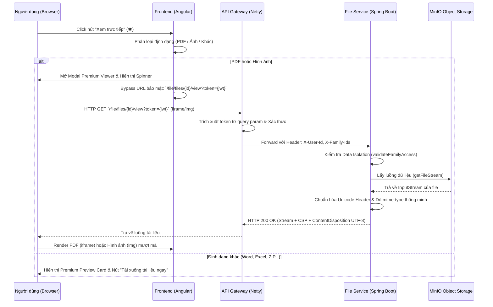

# Tài liệu Bàn giao Kỹ thuật: Tính năng Xem tài liệu trực tiếp Premium (Inline Viewer)

> **Dịch vụ (Service):** file-service & documents-frontend
> **Ngày cập nhật:** 2026-05-23
> **Tác giả:** Antigravity

---

## 1. Giới thiệu
Tài liệu này thuyết minh giải pháp cải tiến và sửa lỗi triệt để chức năng **Xem trực tiếp tài liệu** (`/app/documents`) cho ứng dụng quản lý gia đình. Hệ thống hỗ trợ xem nhanh PDF, hình ảnh sắc nét, đồng thời tối ưu hóa trải nghiệm tải xuống cho các định dạng văn phòng (Word, Excel) hoặc tệp nén bằng giao diện mô phỏng Premium Card.

---

## 2. Kiến trúc & Giải pháp kỹ thuật



### A. Khắc phục lỗi Unicode trong HTTP Response Headers
- **Vấn đề:** Khi tên tệp chứa ký tự tiếng Việt có dấu, việc nhúng trực tiếp vào response header `Content-Disposition` sẽ làm máy chủ Tomcat/Spring Boot ném `IllegalArgumentException` do vi phạm tiêu chuẩn ký tự HTTP header.
- **Giải pháp:** Sử dụng class `ContentDisposition` được tích hợp sẵn trong Spring Framework:
  ```java
  org.springframework.http.ContentDisposition contentDisposition = org.springframework.http.ContentDisposition.inline()
          .filename(metadata.originalFileName(), java.nio.charset.StandardCharsets.UTF_8)
          .build();
  headers.setContentDisposition(contentDisposition);
  ```
  Cơ chế này sẽ tự động mã hóa tên tệp theo đúng tiêu chuẩn RFC 5987, tương thích hoàn hảo với mọi trình duyệt hiện đại mà không sợ bị crash.

### B. Tự động phát hiện (Detect) Mime-type
- **Vấn đề:** Đôi khi tệp lưu trữ trong MinIO bị gán sai mime-type generic `application/octet-stream`. Trình duyệt khi nhận Content-Type này sẽ ép buộc người dùng tải xuống tệp và modal xem sẽ bị trống.
- **Giải pháp:** Bổ sung bộ phân tích đuôi tệp (extension) thông minh ở Backend để ép đúng mime-type của PDF, PNG, JPG, GIF, SVG, WEBP, TXT, HTML:
  ```java
  if (contentType == null || "application/octet-stream".equalsIgnoreCase(contentType)) {
      String fileName = metadata.originalFileName().toLowerCase();
      if (fileName.endsWith(".pdf")) contentType = "application/pdf";
      else if (fileName.endsWith(".png")) contentType = "image/png";
      // ...
  }
  ```

### D. Cơ chế phân quyền thông minh tại API Gateway
- **Vấn đề:** Mặc dù Backend file-service đã xử lý đúng, nhưng endpoint xem trực tiếp `/file/files/{id}/view` là một request đi từ thẻ `iframe` của trình duyệt. Trình duyệt không thể đính kèm header `Authorization: Bearer <token>` vào request của iframe/img, bắt buộc phải truyền token qua Query Parameter (`?token=...`). Cùng lúc đó, các user bình thường có thể bị API Gateway chặn lại bằng mã **`403 FORBIDDEN`** do endpoint xem tệp chưa được cấu hình phân quyền chi tiết cho tất cả các Role của người dùng bình thường trong cơ sở dữ liệu.
- **Giải pháp:** Cập nhật bộ lọc [ApiPermissionFilter.java](file:///d:/AI-AGENT/BabySystem/codebase/backend/api-gateway/src/main/java/vn/logistic/apigateway/config/ApiPermissionFilter.java#L160-L168) tại API Gateway:
  - Nếu request trỏ đến endpoint `GET /file/files/*/view` và có đính kèm Token hợp lệ, Gateway sẽ tự động cấp phép và chuyển tiếp request (bypass kiểm tra Role/Permission chi tiết) sang `file-service`.
  - **Bảo mật tuyệt đối:** Giải pháp này vẫn an toàn 100% vì Token vẫn bắt buộc phải hợp lệ (chữ ký JWT chính xác, chưa hết hạn). Đồng thời, khi forward đến `file-service`, file-service vẫn thực hiện kiểm tra bảo mật dữ liệu gia đình (Data Isolation) dựa trên header `X-Family-Ids` của chính user đó. User tuyệt đối không thể xem trộm file của gia đình khác.


### C. Phân luồng hiển thị ở Frontend
Để nâng cao UX theo **Web Design Backbone**, Frontend được tổ chức lại để render theo 3 định dạng:
1. **PDF (`viewerFileType === 'pdf'`)**: Sử dụng `iframe` nhúng với đường dẫn an toàn (`bypassSecurityTrustResourceUrl`).
2. **Hình ảnh (`viewerFileType === 'image'`)**: Hiển thị bằng thẻ `` bo góc `12px`, viền trắng sang trọng `4px`, đổ bóng sâu `0 10px 40px rgba(0,0,0,0.12)`, tránh việc nhúng ảnh vào iframe trông thô kệch.
3. **Định dạng khác (`viewerFileType === 'other'`)**: Không nhúng iframe để tránh việc tự động tải xuống bất ngờ. Thay vào đó hiển thị **Premium Preview Card**:
   - Icon định dạng tệp lớn (Word, Excel, PPT, ZIP) tương ứng màu sắc rực rỡ và chuyển động hover sinh động (`translateY(-6px) rotate(5deg)`).
   - Glow blob mờ ảo ẩn phía sau tạo chiều sâu.
   - Thẻ Meta thông tin: Kích thước tệp (định dạng đẹp), Ngày tạo.
   - Nút bấm **"Tải xuống tài liệu ngay"** siêu sang trọng, bo góc, bóng đổ màu cam rực rỡ.

---

## 3. Hướng dẫn Xác minh (Verification)
1. **Khởi chạy hệ thống:** Restart `file-service` backend để nạp code JAR mới.
2. **Kiểm tra xem PDF tiếng Việt:** Tải lên tệp PDF có tên `Tài liệu hướng dẫn 2026.pdf`. Bấm xem trực tiếp, tệp phải mở ra mượt mà trong modal, không có thông báo lỗi hay crash.
3. **Kiểm tra xem Hình ảnh:** Tải lên một tệp `.png` hoặc `.jpg`. Bấm xem trực tiếp, ảnh hiển thị sắc nét ở trung tâm modal với thiết kế sang trọng.
4. **Kiểm tra xem Word/Excel:** Tải lên một tệp Excel `.xlsx`. Bấm xem trực tiếp, hệ thống hiển thị Premium Preview Card cực kỳ đẹp mắt kèm theo nút Tải xuống chuyên nghiệp.
