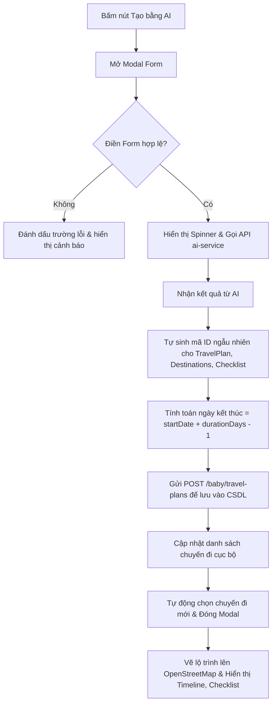

# Tài liệu Thiết kế Frontend: Lập chuyến đi tự động bằng AI (AI Travel Planner UI/UX)

> **Service**: `frontend-service`
> **Tính năng**: Giao diện lập chuyến đi gia đình hoàn chỉnh bằng AI Copilot.
> **Ngày cập nhật**: 2026-06-04

---

## 1. Giao diện & Trải nghiệm Người dùng (WOW UI/UX)

Tuân thủ nghiêm ngặt quy định **Web Design Backbone** của dự án:

1. **Nút "Tạo bằng AI" lấp lánh (`.btn-ai-sparkle`)**:
   - Được đặt bên cạnh nút "Tạo chuyến đi mới" truyền thống trên thanh tiêu đề chính và tại khu vực trống (empty state footer).
   - Thiết kế với viền sắc nét, nền gradient bán trong suốt màu Cam-Hồng (`#f97316` ➡️ `#ec4899`).
   - Sử dụng hiệu ứng chuyển động mượt mà khi hover: Nút nhô lên nhẹ (`translateY(-1.5px)`), tăng bóng mờ tỏa ra (`box-shadow`), và đổi sang nền gradient rực rỡ để mang lại cảm giác sống động (alive UI).

2. **Modal "Lập chuyến đi bằng AI"**:
   - Thiết kế form theo chiều dọc (`nzLayout="vertical"`) giúp giao diện thoáng đãng, dễ điền trên cả màn hình di động và máy tính.
   - Bo góc mềm mại cho tất cả input và dropdown (`border-radius: 10px`), đồng bộ với phong cách thiết kế chung.
   - **Form Fields**:
     - *Điểm đến*: Trường nhập liệu tự do, hiển thị ví dụ gợi ý điểm đến phổ biến.
     - *Số ngày đi*: Chọn từ danh sách dropdown từ 1 đến 7 ngày.
     - *Ngày khởi hành*: Lịch chọn ngày (`nz-date-picker`) bắt buộc để tính toán chính xác ngày kết thúc và lịch trình theo ngày thực tế.
     - *Yêu cầu đặc biệt*: Trường text vùng rộng cho phép người dùng mô tả chi tiết ngữ cảnh gia đình (ví dụ: trẻ sơ sinh, người già đi cùng, sở thích ẩm thực).

3. **Hiệu ứng Đang sinh lịch trình (AI Generating State)**:
   - Hiệu ứng quay spinner kết hợp tip text thay đổi trạng thái sinh động.
   - Toàn bộ modal sẽ bị mờ đi và bị chặn tương tác (`nz-spin`) để người dùng cảm nhận được hệ thống đang xử lý dữ liệu phức tạp.

---

## 2. Luồng xử lý dữ liệu trên Frontend

---

## 3. Hệ thống khóa i18n (Đa ngôn ngữ)

Bắt buộc cấu hình đầy đủ trên 4 ngôn ngữ tại `public/i18n/app/travel/` để hỗ trợ đa quốc gia:

| Khóa i18n | Tiếng Việt (`vi.json`) | Tiếng Anh (`en.json`) | Tiếng Trung (`zh.json`) | Tiếng Nhật (`ja.json`) |
| :--- | :--- | :--- | :--- | :--- |
| `generateAiTrip` | Tạo bằng AI | Generate with AI | AI 自动生成 | AIで作成 |
| `aiCreateTitle` | Lập Chuyến đi Tự động bằng AI | Auto-Plan Trip with AI | AI 自动规划旅行 | AI自動旅行プラン作成 |
| `aiCreateSub` | Nhập điểm đến và yêu cầu để AI tự động thiết lập toàn bộ lịch trình... | Enter your destination and requests for the AI to auto-configure... | 输入您的目的地和需求，让 AI 自动配置整个行程... | 目的地と要望を入力するだけで、AIが日程... |
| `destinationLabel` | Điểm đến mong muốn | Desired Destination | 期望目的地 | 目的地 |
| `durationLabel` | Số ngày đi dự kiến | Expected Duration | 预计旅行天数 | 予定日数 |
| `startDateLabel` | Ngày bắt đầu khởi hành | Departure Date | 出发日期 | 出発日 |
| `preferencesLabel` | Yêu cầu đặc biệt (Ngữ cảnh gia đình) | Special Requests (Family Context) | 特殊需求（家庭情况） | 特別な要望（家族構成など） |
| `generateBtn` | Lập lịch trình bằng AI | Generate Itinerary with AI | 使用 AI 生成行程 | AIで旅行プランを生成 |
| `aiGeneratingPlan` | AI đang lập lịch trình chi tiết và chuẩn bị đồ dùng... | AI is constructing your detailed itinerary and checklist... | AI 正在构建您的详细行程和清单... | AIが詳細な日程と準備リストを作成中... |
| `day` | ngày | day | 天 | 日 |
| `days` | ngày | days | 天 | 日 |

---

## 4. Kiểm tra khả năng hoạt động

1. **Tọa độ địa lý**: AI phản hồi các địa danh du lịch thực tế với tọa độ vĩ độ (`lat`) và kinh độ (`lng`) thực. Lớp bản đồ Leaflet vẽ lộ trình dạng đường nối liền các điểm đến trên bản đồ.
2. **Thay đổi Change Detection**: Frontend Angular thực hiện gán lại mảng `travelPlans = [...this.travelPlans, saved]` để kích hoạt trình phát hiện thay đổi của Angular, đảm bảo giao diện cập nhật ngay lập tức.
