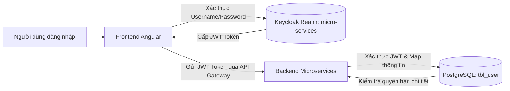

# Hướng Dẫn Cấu Hình Và Quản Trị Hệ Thống Keycloak Identity Provider (BabySystem)

Tài liệu này cung cấp hướng dẫn chi tiết về cấu hình, danh sách các tài khoản người dùng được thiết lập sẵn, và quy trình cập nhật/khởi động lại dịch vụ xác thực Keycloak trong dự án **BabySystem**.

---

## 1. Kiến Trúc Xác Thực Và Liên Kết Tài Khoản
Hệ thống BabySystem áp dụng cơ chế xác thực tập trung (Single Sign-On - SSO) sử dụng **Keycloak** làm Identity Provider (IdP) kết hợp với Cơ sở dữ liệu PostgreSQL cục bộ cho các dịch vụ nghiệp vụ (Microservices).

### Sơ đồ liên kết tài khoản (Database & Keycloak)
Mỗi người dùng trong hệ thống tồn tại song song ở hai nơi và được liên kết chặt chẽ thông qua thuộc tính **`username`**:
1. **Keycloak Realm (`micro-services`)**: Chịu trách nhiệm xác thực thông tin đăng nhập (mật khẩu), cấp mã Token JWT (`access_token`, `refresh_token`), và xử lý các giao dịch OAuth2/OIDC.
2. **Cơ sở dữ liệu PostgreSQL (`tbl_user` trong authentication-service)**: Lưu trữ thông tin chi tiết người dùng, phân quyền chi tiết (Roles/Permissions), và các trạng thái nghiệp vụ đặc thù (2FA, Avatar, v.v.).



---

## 2. Danh Sách Tài Khoản Mặc Định (Pre-configured Users)

Các tài khoản dưới đây được cấu hình sẵn trong file khởi tạo `micro-services-realm.json` và đã được đồng bộ với migration SQL cục bộ (`V11__add_new_users.sql`):

### 2.1. Tài khoản Quản trị viên (Admin Account)
Tài khoản có toàn quyền quản trị và vận hành toàn hệ thống.

#### Tài khoản `truongkin0`
* **Username**: `truongkin0`
* **Họ và tên**: Truong Kinn
* **Email**: `truongkin0@local`
* **Trạng thái**: Đã kích hoạt (`enabled: true`)
* **Xác thực email**: Đã xác thực (`emailVerified: true`)
* **Mật khẩu khởi tạo**: `admin123`
* **Quyền hạn trong DB**: Quyền `ADMIN` (được gán Role ID 2 thông qua migration `V36`).

#### Tài khoản `truongtv11`
* **Username**: `truongtv11`
* **Họ và tên**: Truong TV11
* **Email**: `truongtv11@local`
* **Trạng thái**: Đã kích hoạt (`enabled: true`)
* **Xác thực email**: Đã xác thực (`emailVerified: true`)
* **Mật khẩu khởi tạo**: `admin123`
* **Quyền hạn trong DB**: Quyền `ADMIN` (được gán Role ID 2 thông qua migration `V11`).

### 2.2. Tài khoản Người dùng thường (User Account)
Tài khoản người dùng chuẩn, sử dụng các chức năng nghiệp vụ của ứng dụng.
* **Username**: `chinhntt`
* **Họ và tên**: Chinh NTT
* **Email**: `chinhntt@local`
* **Trạng thái**: Đã kích hoạt (`enabled: true`)
* **Xác thực email**: Đã xác thực (`emailVerified: true`)
* **Mật khẩu khởi tạo**: `demo123`
* **Quyền hạn trong DB**: Quyền `USER` (được gán Role ID 1 thông qua migration `V11`).

### 2.3. Tài khoản Demo (Demo User)
Tài khoản mẫu phục vụ mục đích kiểm thử nhanh và trình diễn.
* **Username**: `demo.user`
* **Họ và tên**: Demo User
* **Email**: `demo.user@local.dev`
* **Trạng thái**: Đã kích hoạt (`enabled: true`)
* **Xác thực email**: Đã xác thực (`emailVerified: true`)
* **Mật khẩu khởi tạo**: `demo123`

---

## 3. Quy Trình Khởi Động Và Cập Nhật Keycloak (Update & Restart)

Do Keycloak lưu trữ trạng thái cơ sở dữ liệu nội bộ trong Docker Volume, việc chỉnh sửa file JSON cấu hình realm (`micro-services-realm.json`) sẽ **không** tự động áp dụng nếu container Keycloak cũ đang chạy. Để cập nhật thành công các tài khoản mới, bạn cần thực hiện quy trình dọn dẹp volume và khởi động lại dưới đây:

### Bước 1: Dừng dịch vụ Keycloak cũ và Xóa Volume dữ liệu
Sử dụng tham số `-v` (hoặc `--volumes`) để đảm bảo Docker dọn dẹp sạch sẽ database H2 cũ chứa cấu hình realm lỗi thời:
```bash
docker compose -f codebase/infrastructure/docker-compose.yml down keycloak -v
```

### Bước 2: Khởi động lại dịch vụ Keycloak
Lệnh này sẽ tạo lại volume sạch, tự động đọc và import file realm cấu hình mới nhất tại `./keycloak/micro-services-realm.json`:
```bash
docker compose -f codebase/infrastructure/docker-compose.yml up -d keycloak
```

### Bước 3: Kiểm tra tiến trình Khởi chạy & Import
Kiểm tra log của container để chắc chắn Keycloak đã boot hoàn tất và import thành công không gặp lỗi:
```bash
docker logs mom-keycloak --tail 50
```

> [!IMPORTANT]
> **Dấu hiệu thành công**: Trong log xuất hiện thông báo dịch vụ Keycloak đã lắng nghe tại cổng `8080` và import thành công realm `micro-services`.

---

## 4. Cấu Hình Chi Tiết Client (OpenID Connect)
Client dành cho ứng dụng Frontend SPA (Angular) được cấu hình với các thông số bảo mật cao cấp:
* **Client ID**: `frontend-app`
* **Protocol**: `openid-connect`
* **Access Type**: Public (`publicClient: true`)
* **Cơ chế PKCE**: Bắt buộc sử dụng phương pháp mã hóa `S256` (`pkce.code.challenge.method: S256`) nhằm ngăn chặn tấn công đánh cắp Authorization Code trên các ứng dụng SPA client-side.
* **Redirect URIs**: Cho phép chuyển hướng về trang phát triển local `http://localhost:4200/*`
* **Web Origins**: Cho phép CORS từ `http://localhost:4200`
* **Default Scopes**: `web-origins`, `profile`, `roles`, `email`

---

## 5. Cấu Hình Custom Theme Đăng Nhập (babysystem)

Hệ thống sử dụng một Custom Theme của Keycloak (tên là `babysystem`) để đồng bộ giao diện đăng nhập SSO tập trung của Keycloak với phong cách thiết kế hiện đại của ứng dụng chính (tông màu xanh Teal `#0f766e` chủ đạo và màu cam nhấn `#ea580c`).

### 5.1. Cấu trúc thư mục của Theme trong Project
Tất cả các tài nguyên giao diện của custom theme được lưu trữ tại đường dẫn sau trong dự án:
```text
codebase/infrastructure/keycloak/themes/babysystem/
└── login/
    ├── theme.properties
    └── resources/
        └── css/
            └── login.css
```

* **`theme.properties`**: Định nghĩa cấu hình kế thừa từ theme `keycloak` mặc định và khai báo CSS file tùy biến:
  ```properties
  parent=keycloak
  import=common/keycloak
  styles=css/login.css
  ```
* **`login.css`**: Chứa toàn bộ mã CSS ghi đè giao diện đăng nhập mặc định của Keycloak, bao gồm:
  - Nền lưới tọa độ mịn, gradient Teal-Cam nhạt đồng nhất với ứng dụng.
  - Card chứa form bo góc 14px, shadow 3 tầng sâu, nền trắng tinh khiết.
  - Logo hình trái tim giả lập màu đỏ trên nền gradient xanh da trời (đồng điệu với sidebar).
  - Inputs cao 44px, bo góc 8px, focus ring màu xanh Teal mượt mà.
  - Submit Button màu xanh Teal đậm, hover nhô lên kèm shadow óng ánh.
  - Hỗ trợ đầy đủ hiển thị Responsive và Dark Theme (`.dark-theme`).

### 5.2. Cách thức triển khai và mount Container
Dịch vụ Keycloak trong `docker-compose.yml` được mount thêm thư mục chứa theme tùy chỉnh thông qua volume:
```yaml
  keycloak:
    ...
    volumes:
      - keycloak_data:/opt/keycloak/data
      - ./keycloak:/opt/keycloak/data/import
      - ./keycloak/themes:/opt/keycloak/themes  # Volume mount cho custom themes
```

### 5.3. Áp dụng Theme tự động qua Realm
Theme được tự động kích hoạt cho realm `micro-services` thông qua thuộc tính `"loginTheme"` trong file cấu hình Realm [micro-services-realm.json](file:///d:/AI-AGENT/BabySystem/codebase/infrastructure/keycloak/micro-services-realm.json):
```json
{
  "realm": "micro-services",
  "enabled": true,
  "displayName": "Micro Services",
  "loginTheme": "babysystem",  // Áp dụng custom theme babysystem
  ...
}
```

### 5.4. Hướng dẫn bảo trì và tùy biến thêm
Khi có nhu cầu thay đổi giao diện trang đăng nhập Keycloak:
1. Bạn chỉnh sửa trực tiếp mã CSS tại tệp tin [login.css](file:///d:/AI-AGENT/BabySystem/codebase/infrastructure/keycloak/themes/babysystem/login/resources/css/login.css).
2. Do thư mục `themes` được mount dạng Live (Host sang Container), các thay đổi CSS sẽ được áp dụng ngay lập tức mà **không cần khởi động lại container Keycloak**. Bạn chỉ cần nhấn `F5` hoặc xóa cache trình duyệt để kiểm tra trực quan.
