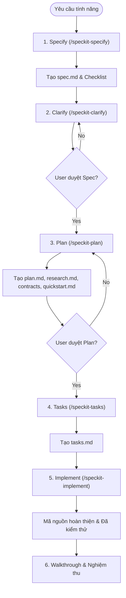

# Hướng Dẫn Sử Dụng Spec-Kit (Spec-Driven Development - SDD)

**Spec-Kit** là một bộ công cụ hỗ trợ quy trình phát triển dựa trên đặc tả (Spec-Driven Development - SDD) tích hợp sẵn trong dự án **BabySystem**. Quy trình này giúp chuyển đổi các yêu cầu tính năng từ ngôn ngữ tự nhiên thành mã nguồn hoàn chỉnh thông qua các bước lập kế hoạch và thiết kế chặt chẽ, giảm thiểu rủi ro thiết kế sai lệch hoặc thiếu sót.

---

## 🔄 Vòng Đời Phát Triển SDD Chuẩn (Full SDD Cycle)

Quy trình SDD được chia thành các giai đoạn tuần tự với các ranh giới kiểm soát (review gates) để đảm bảo chất lượng:



---

## 🛠️ Chi Tiết Các Lệnh & Cách Sử Dụng

### 1. `/speckit-specify` - Tạo Đặc Tả Tính Năng
*   **Mục đích**: Nhận mô tả tính năng bằng ngôn ngữ tự nhiên từ người dùng, tạo thư mục tính năng mới trong thư mục `specs/` (ví dụ: `specs/001-payment-gateway/spec.md`) và khởi tạo danh sách kiểm tra chất lượng spec (`checklists/requirements.md`).
*   **Cách sử dụng**:
    ```text
    /speckit-specify [mô tả chi tiết yêu cầu tính năng bạn muốn xây dựng]
    ```
*   **Lưu ý**: Lệnh này chỉ tập trung vào **CÁI GÌ (WHAT)** và **TẠI SAO (WHY)** dưới góc nhìn nghiệp vụ, hoàn toàn không đề cập đến chi tiết công nghệ (framework, cơ sở dữ liệu, API).

### 2. `/speckit-clarify` - Làm Rõ Sự Mơ Hồ
*   **Mục đích**: Rà quét file đặc tả `spec.md` để phát hiện các điểm chưa rõ ràng, thiếu thông tin (ví dụ: edge cases, phân quyền, dữ liệu...). AI sẽ đưa ra tối đa 5 câu hỏi trắc nghiệm hoặc câu hỏi ngắn tuần tự để làm rõ và tự động cập nhật kết quả vào spec.
*   **Cách sử dụng**:
    ```text
    /speckit-clarify
    ```
*   **Lưu ý**: Nên thực hiện lệnh này và trả lời các câu hỏi làm rõ trước khi chuyển sang bước lập kế hoạch triển khai.

### 3. `/speckit-plan` - Lập Kế Hoạch Triển Khai Kỹ Thuật
*   **Mục đích**: Dựa trên `spec.md` đã được duyệt, phân tích cấu trúc codebase hiện tại để lập kế hoạch kỹ thuật chi tiết. Lệnh này sẽ tạo ra:
    *   `implementation_plan.md`: Bản kế hoạch tổng thể.
    *   `research.md`: Tài liệu nghiên cứu công nghệ & giải pháp.
    *   `data-model.md`: Thiết kế thực thể, quan hệ cơ sở dữ liệu.
    *   Thư mục `contracts/`: Định nghĩa các API contract, giao tiếp.
    *   `quickstart.md`: Hướng dẫn kiểm thử và chạy thử kịch bản end-to-end.
*   **Cách sử dụng**:
    ```text
    /speckit-plan
    ```
*   **Lưu ý**: Bạn cần xem xét kỹ tài liệu `implementation_plan.md` được tạo ra để phê duyệt hoặc yêu cầu chỉnh sửa trước khi chuyển sang bước tiếp theo.

### 4. `/speckit-tasks` - Phân Rã Tác Vụ
*   **Mục đích**: Chuyển đổi kế hoạch kỹ thuật thành danh sách tác vụ cụ thể, có thứ tự phụ thuộc hợp lý và lưu tại file `task.md` (hoặc `tasks.md` tùy phiên bản).
*   **Cách sử dụng**:
    ```text
    /speckit-tasks
    ```
*   **Lưu ý**: File này đóng vai trò là bảng TODO của AI Agent trong quá trình code.

### 5. `/speckit-implement` - Thực Thi & Viết Code
*   **Mục đích**: AI Agent sẽ đọc file `task.md`, lần lượt thực thi và hoàn thành từng tác vụ (sửa file, tạo file mới, chạy lệnh build, kiểm thử...) và cập nhật trạng thái tiến độ trực tiếp vào file task.
*   **Cách sử dụng**:
    ```text
    /speckit-implement
    ```
*   **Lưu ý**: AI sẽ dừng và báo cáo tiến độ, chạy các test case để đảm bảo code hoạt động chính xác trước khi kết thúc.

---

## ⚡ Quy Trình Xử Lý Change Request (CR) / Thay Đổi Yêu Cầu

Khi một tính năng đang triển khai hoặc đã hoàn tất nhưng có **phát sinh yêu cầu thay đổi (CR)**, bạn thực hiện theo quy trình 4 bước sau để cập nhật một cách an toàn và nhất quán:


### Bước 1: Cập nhật Đặc tả (`spec.md`)
*   **Cách làm**: Mở file `spec.md` của tính năng hiện tại (ví dụ: `specs/003-user-auth/spec.md`) và thêm trực tiếp các yêu cầu chức năng mới (FR-xxx) hoặc tiêu chí thành công mới (SC-xxx) vào các mục tương ứng. Bạn cũng có thể yêu cầu AI Agent cập nhật bằng cách mô tả yêu cầu CR cho AI.

### Bước 2: Cập nhật Kế hoạch Triển khai (`plan.md`)
*   **Cách làm**: Chạy lệnh `/speckit-plan`
*   **Mục đích**: AI Agent sẽ đọc file `spec.md` đã cập nhật ở Bước 1 và phân tích lại codebase để cập nhật thiết kế kỹ thuật, mô hình dữ liệu (`data-model.md`), contracts và kịch bản test nhanh (`quickstart.md`) sao cho phù hợp với CR.

### Bước 3: Đồng bộ hóa & Phát sinh Tác vụ (`/speckit-converge`)
*   **Cách làm**: Chạy lệnh `/speckit-converge`
*   **Mục đích**: Lệnh này sẽ so sánh mã nguồn hiện tại với đặc tả mới (`spec.md`) và kế hoạch mới (`plan.md`). AI sẽ phát hiện những yêu cầu nào từ CR chưa được lập trình, từ đó **tạo ra một Phase mới** ở cuối file `tasks.md` (ví dụ: `## Phase 3: Convergence`) và append các task cần thực hiện vào đó.
*   *Lưu ý: `/speckit-converge` hoạt động theo nguyên tắc append-only (chỉ thêm mới), tuyệt đối không xóa hoặc làm xáo trộn các task cũ đã hoàn thành.*

### Bước 4: Triển khai CR vào Code (`/speckit-implement`)
*   **Cách làm**: Chạy lệnh `/speckit-implement`
*   **Mục đích**: AI Agent sẽ tiến hành thực thi các task mới vừa được tạo ra ở Phase Convergence trong file `tasks.md` để cập nhật mã nguồn theo đúng CR.

---

## ⚙️ Các Lệnh Bổ Trợ Khác

*   `/speckit-checklist`: Tạo checklist tùy chỉnh cho tính năng hiện tại dựa trên yêu cầu người dùng.
*   `/speckit-constitution`: Tạo hoặc cập nhật hiến pháp dự án (`.specify/memory/constitution.md`) nhằm thiết lập các nguyên tắc và ràng buộc kỹ thuật chung (ví dụ: phong cách code, công nghệ bắt buộc...).
*   `/speckit-analyze`: Phân tích sự nhất quán và chất lượng chéo giữa đặc tả (`spec.md`), kế hoạch (`plan.md`) và tác vụ (`tasks.md`).
*   `/speckit-taskstoissues`: Chuyển đổi danh sách tác vụ trong `tasks.md` thành các GitHub Issues để theo dõi trên repository.

---

## 📂 Cấu Trúc Thư Mục Hệ Thống `.specify`

Các tài nguyên cấu hình của Spec-Kit được lưu trữ tại thư mục `.specify/` ở thư mục gốc của dự án:
*   `templates/`: Chứa các bản mẫu chuẩn cho đặc tả (`spec-template.md`), kế hoạch (`plan-template.md`), tác vụ (`tasks-template.md`), hiến pháp (`constitution-template.md`), và checklist (`checklist-template.md`).
*   `scripts/powershell/`: Chứa các script tự động hóa bằng PowerShell giúp thiết lập môi trường và kiểm tra điều kiện.
*   `memory/`: Lưu trữ bộ nhớ dự án lâu dài, tiêu biểu là `constitution.md`.
*   `init-options.json` & `integration.json`: Lưu cấu hình tích hợp của Spec-Kit với mô hình AI (ở đây là Antigravity).

---

> [!TIP]
> **Khuyên dùng**: Hãy luôn tuân thủ tuần tự các bước SDD. Việc bỏ qua các bước thiết kế (`specify`, `clarify`, `plan`) và nhảy thẳng vào viết code thường dẫn đến code bị lỗi kiến trúc, thiếu các trường hợp biên (edge cases) và tốn nhiều thời gian sửa chữa hơn.
