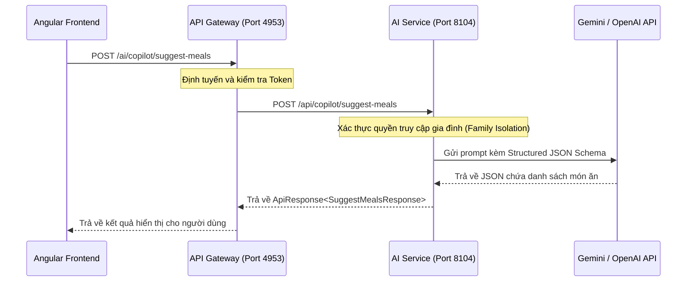

# Tài Liệu Kỹ Thuật: Dịch Vụ AI Gợi Ý Món Ăn (Suggest Meals Service)

Tài liệu này mô tả chi tiết kiến trúc, thiết kế API và hướng dẫn tích hợp cho chức năng **Gợi ý món ăn thông minh bằng AI** của hệ thống quản lý gia đình **BabySystem**.

---

## 1. Tổng Quan

Chức năng gợi ý món ăn bằng AI hỗ trợ các gia đình lên thực đơn hàng ngày hoặc hàng tuần một cách nhanh chóng dựa trên danh sách các nguyên liệu hiện có trong bếp (ví dụ: thịt gà, nấm, cà rốt...). Hệ thống sử dụng các mô hình ngôn ngữ lớn tiên tiến (LLM) như Gemini hoặc OpenAI để đưa ra các đề xuất món ăn khoa học, lành mạnh và dễ chế biến.

---

## 2. Kiến Trúc Hệ Thống

Hệ thống được thiết kế theo mô hình Microservices:



### Điểm nổi bật trong thiết kế:
- **Data Isolation (Cô lập dữ liệu)**: AI Service xác thực quyền truy cập của người dùng đối với Family ID được yêu cầu thông qua context `UserAccessContext`, đảm bảo an toàn thông tin giữa các gia đình.
- **Structured Outputs (Gemini)**: Tận dụng tính năng Structured Outputs của Gemini API bằng cách gửi kèm JSON Schema chi tiết, ép buộc mô hình AI trả về kết quả JSON chính xác 100%, triệt tiêu hoàn toàn lỗi parse JSON ở backend.
- **OpenAI Fallback**: Cung cấp prompt đặc thù và cơ chế JSON mode dự phòng trong trường hợp hệ thống được cấu hình chạy bằng OpenAI.

---

## 3. Chi Tiết API Endpoint

### Endpoint: `POST /ai/copilot/suggest-meals` (thông qua Gateway)
*Đường dẫn thực tế trong AI Service: `POST /api/copilot/suggest-meals`*

#### Headers yêu cầu:
- `Authorization: Bearer <JWT_Token>`
- `X-User-Id`: ID người dùng hiện tại (Gateway tự động điền)
- `X-Family-Ids`: Danh sách ID gia đình người dùng được phép truy cập (Gateway tự động điền)
- `X-User-Admin`: Quyền admin (Gateway tự động điền)

#### Body Request (`SuggestMealsRequest`):
```json
{
  "familyId": 1,
  "ingredients": "gà, nấm, hạt sen, hành",
  "language": "vi"
}
```

| Trường | Kiểu dữ liệu | Bắt buộc | Mô tả |
| :--- | :--- | :--- | :--- |
| `familyId` | Long | Có | ID của gia đình cần áp dụng thực đơn. |
| `ingredients` | String | Có | Danh sách nguyên liệu người dùng nhập vào. |
| `language` | String | Không | Ngôn ngữ phản hồi (mặc định là `vi`, hỗ trợ `en`, `zh`, `ja`). |

#### Body Response (`SuggestMealsResponse`):
```json
{
  "success": true,
  "message": "Success",
  "data": {
    "dishes": [
      {
        "name": "Cháo gà hạt sen",
        "description": "Món cháo gà ấm nóng, bổ dưỡng và rất dễ tiêu hóa, phù hợp cho cả nhà và bé yêu.",
        "ingredients": ["Thịt gà", "Hạt sen", "Gạo", "Hành lá", "Gia vị"],
        "mealType": "BREAKFAST"
      },
      {
        "name": "Gà hấp nấm",
        "description": "Thịt gà dai ngọt hấp cùng nấm hương thơm lừng, giữ trọn vẹn hương vị tự nhiên.",
        "ingredients": ["Thịt gà", "Nấm", "Hành", "Gừng"],
        "mealType": "DINNER"
      }
    ]
  }
}
```

| Trường | Kiểu dữ liệu | Mô tả |
| :--- | :--- | :--- |
| `dishes` | Array | Danh sách các món ăn do AI gợi ý. |
| `dishes[].name` | String | Tên món ăn. |
| `dishes[].description` | String | Mô tả ngắn gọn về món ăn và cách chế biến sơ bộ. |
| `dishes[].ingredients` | Array<String> | Danh sách nguyên liệu chi tiết cần chuẩn bị. |
| `dishes[].mealType` | String | Phân loại bữa ăn phù hợp (`BREAKFAST`, `LUNCH`, `DINNER`, `SNACK`). |

---

## 4. Tích Hợp Frontend Angular

Component `meals.component.ts` giao tiếp trực tiếp với Gateway bằng cách sử dụng `HttpClient`:

```typescript
const familyId = this.command.getFamilyId();
const language = this.i18n.getCurrentLanguage();

this.http.post<any>(`${API_CONFIG.GATEWAY_URL}/ai/copilot/suggest-meals`, {
  familyId,
  ingredients: this.aiIngredients,
  language
}).subscribe({
  next: (response) => {
    const apiData = response?.data?.dishes ?? response?.data ?? [];
    this.aiSuggestions = apiData.map((d: any) => ({
      name: d.name,
      description: d.description,
      ingredients: d.ingredients,
      mealType: d.mealType,
      selected: false
    }));
  }
});
```

---

## 5. Cấu Hình & Deploy

Dịch vụ này sử dụng các cấu hình sẵn có của `ai-service`:
- **Model**: `gemini-3.5-flash` (được tự động ánh xạ ổn định từ cấu hình hệ thống).
- **API Key**: Được cấu hình thông qua biến môi trường `GEMINI_API_KEY` hoặc `OPENAI_API_KEY` trong file `application.yml` hoặc profile tương ứng của `ai-service`.
